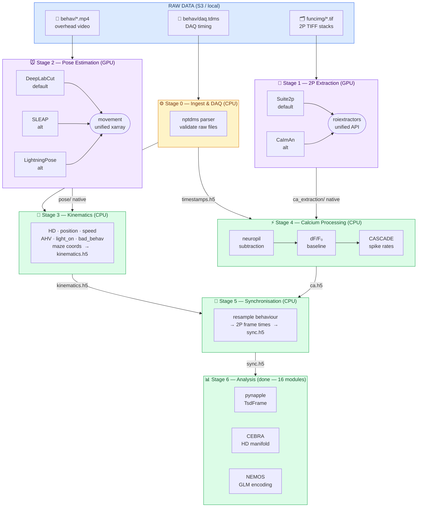
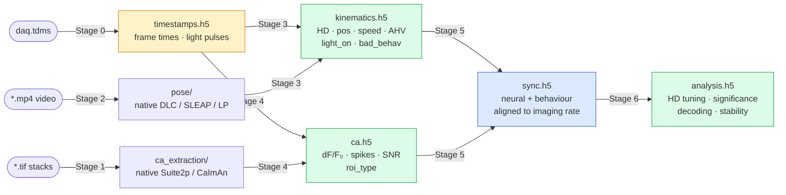
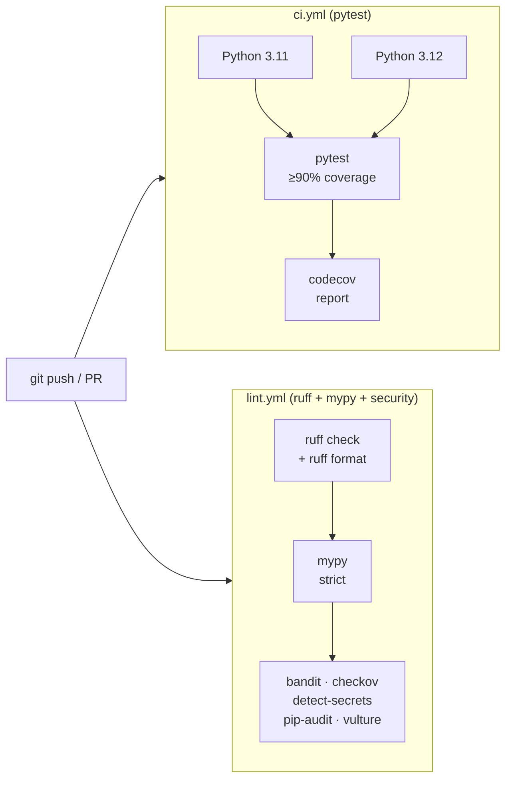

# Architecture — hm2p-v2

## System Overview

The pipeline ingests raw two-photon calcium imaging data and overhead behavioural video,
processes them independently through pluggable extractor/tracker backends, then joins them
into a synchronised per-session dataset. All data lives in AWS S3; compute runs on AWS EC2
or locally.



### Intermediate File Data Flow



---

## Component Architecture

### Source Layout

```text
hm2p-v2/
├── src/
│   └── hm2p/
│       ├── __init__.py
│       ├── cli.py                 # Command-line interface entry points
│       ├── config.py              # Pydantic settings: paths, compute profile, versions
│       ├── constants.py           # Shared constants (bin counts, thresholds, etc.)
│       ├── plotting.py            # Shared plotting utilities
│       ├── session.py             # Session dataclass, registry loading from experiments.csv
│       ├── ingest/
│       │   ├── __init__.py
│       │   ├── validate.py        # Check raw file completeness per session
│       │   └── daq.py             # TDMS → timestamps.h5 (nptdms; Stage 0)
│       ├── extraction/
│       │   ├── __init__.py
│       │   ├── base.py            # Abstract extractor interface (wraps roiextractors)
│       │   ├── suite2p.py         # Suite2pExtractor + post-hoc soma/dend classification
│       │   ├── zdrift.py          # Z-drift estimation from serial2p z-stacks
│       │   └── caiman.py          # CaimanExtractor
│       ├── pose/
│       │   ├── __init__.py
│       │   ├── preprocess.py      # load_meta + undistort/crop utils (videos are pre-processed)
│       │   ├── quality.py         # Pose quality metrics: PCK, likelihood, jitter
│       │   ├── retrain.py         # Helpers for DLC active-learning retraining
│       │   └── run.py             # Dispatch to DLC / SLEAP / LP based on session.tracker
│       ├── kinematics/
│       │   ├── __init__.py
│       │   ├── compute.py         # Load via movement, compute HD/position/speed/AHV
│       │   └── syllables.py       # OPTIONAL Stage 3b: VAME / keypoint-MoSeq syllable discovery
│       ├── calcium/
│       │   ├── __init__.py
│       │   ├── neuropil.py        # Neuropil subtraction (fixed coeff + FISSA)
│       │   ├── dff.py             # dF/F0 computation
│       │   ├── spikes.py          # CASCADE calibrated spike inference
│       │   ├── events.py          # Voigts & Harnett fallback event detection
│       │   └── run.py             # Stage 4 runner: neuropil → dF/F → CASCADE → ca.h5
│       ├── analysis/
│       │   ├── __init__.py
│       │   ├── cache.py           # Analysis result caching utilities
│       │   ├── activity.py        # Active-cell detection and firing rate stats
│       │   ├── tuning.py          # HD tuning curves, PD, MVL, Rayleigh
│       │   ├── significance.py    # Circular shuffle tests for HD significance
│       │   ├── comparison.py      # Tuning curve correlation, PD shift, split-half
│       │   ├── decoder.py         # Bayesian population HD decoder
│       │   ├── stability.py       # Temporal stability, light/dark drift
│       │   ├── population.py      # Population-level summary statistics
│       │   ├── ahv.py             # Angular head velocity tuning
│       │   ├── information.py     # Spatial / directional information (Skaggs)
│       │   ├── classify.py        # Automated HD cell classification
│       │   ├── gain.py            # Light/dark gain modulation index
│       │   ├── anchoring.py       # Visual vs idiothetic HD anchoring
│       │   ├── speed.py           # Speed modulation analysis
│       │   ├── run.py             # Stage 6 runner: full analysis pipeline
│       │   └── save.py            # Write analysis.h5 outputs
│       ├── maze/
│       │   ├── __init__.py
│       │   ├── topology.py        # Rose-maze graph: 7×5 grid, adjacency, dead ends
│       │   ├── discretize.py      # Continuous x/y → maze cell assignment
│       │   └── analysis.py        # Occupancy, exploration, turn bias, sequences
│       ├── anatomy/
│       │   ├── __init__.py
│       │   ├── register.py        # brainreg: serial2p → Allen CCFv3 registration
│       │   └── injection.py       # Injection site extraction from brainreg output
│       ├── sync/
│       │   ├── __init__.py
│       │   ├── align.py           # Resample behaviour to imaging timestamps
│       │   └── validate.py        # Post-sync validation: shape, NaN, temporal monotonicity
│       ├── patching/
│       │   ├── __init__.py
│       │   ├── config.py           # Patching pipeline configuration
│       │   ├── io.py               # WaveSurfer H5 + SWC file I/O
│       │   ├── ephys.py            # Electrophysiology signal processing
│       │   ├── protocols.py        # Stimulus protocol parsing & response extraction
│       │   ├── spike_features.py   # AP waveform feature extraction
│       │   ├── morphology.py       # SWC morphology loading & analysis
│       │   ├── metrics.py          # Intrinsic excitability & passive properties
│       │   ├── statistics.py       # Statistical comparisons (Penk vs non-Penk)
│       │   ├── pca.py              # PCA on electrophysiological features
│       │   └── run.py              # Batch runner for patching analysis
│       └── io/
│           ├── __init__.py
│           ├── hdf5.py            # Read/write all .h5 files; pandera schema validation
│           ├── nwb.py             # neuroconv wrapper: HDF5 → NWB export
│           └── s3.py              # S3 path resolution (cloud vs local)
├── tests/
│   ├── conftest.py                # shared pytest fixtures (synthetic data only)
│   ├── test_cli.py
│   ├── test_config.py
│   ├── test_plotting.py
│   ├── test_session.py
│   ├── analysis/
│   │   ├── test_activity.py
│   │   ├── test_ahv.py
│   │   ├── test_anchoring.py
│   │   ├── test_cache.py
│   │   ├── test_classify.py
│   │   ├── test_comparison.py
│   │   ├── test_decoder.py
│   │   ├── test_gain.py
│   │   ├── test_hypothesis_analysis.py
│   │   ├── test_information.py
│   │   ├── test_population.py
│   │   ├── test_run.py
│   │   ├── test_save.py
│   │   ├── test_significance.py
│   │   ├── test_speed.py
│   │   ├── test_stability.py
│   │   └── test_tuning.py
│   ├── ingest/
│   │   ├── test_validate.py
│   │   └── test_daq.py
│   ├── extraction/
│   │   ├── test_suite2p.py
│   │   └── test_caiman.py
│   ├── pose/
│   │   └── test_preprocess.py
│   ├── kinematics/
│   │   ├── test_compute.py
│   │   └── test_syllables.py
│   ├── calcium/
│   │   ├── test_neuropil.py
│   │   ├── test_dff.py
│   │   ├── test_spikes.py
│   │   └── test_events.py
│   ├── sync/
│   │   └── test_align.py
│   ├── patching/
│   │   ├── test_config.py
│   │   ├── test_io.py
│   │   ├── test_ephys.py
│   │   ├── test_protocols.py
│   │   ├── test_spike_features.py
│   │   ├── test_morphology.py
│   │   ├── test_metrics.py
│   │   ├── test_statistics.py
│   │   ├── test_pca.py
│   │   └── test_run.py
│   └── io/
│       ├── test_hdf5.py
│       └── test_nwb.py
├── workflow/
│   ├── Snakefile                  # Main DAG
│   ├── rules/
│   │   ├── ingest.smk
│   │   ├── extraction.smk
│   │   ├── pose.smk
│   │   ├── kinematics.smk
│   │   ├── calcium.smk
│   │   └── sync.smk
│   └── profiles/
│       ├── local/config.yaml      # Local CPU execution
│       ├── local-gpu/config.yaml  # Local GPU execution
│       └── aws-batch/config.yaml  # AWS Batch execution
├── config/
│   ├── pipeline.yaml              # Session-level parameters (alpha, thresholds, etc.)
│   └── compute.yaml               # Active compute profile
├── docker/
│   ├── gpu.Dockerfile             # Suite2p + DLC + CUDA
│   ├── cpu.Dockerfile             # movement + calcium + sync
│   └── kpms.Dockerfile            # keypoint-MoSeq isolated env
├── frontend/
│   ├── app.py                     # Streamlit entry point (st.navigation)
│   ├── data.py                    # S3 data loading, caching, session filters
│   └── pages/                     # 43+ page modules (one per analysis view)
├── scripts/
│   └── run_kpms.py                # keypoint-MoSeq batch runner
├── PLAN.md
├── ARCHITECTURE.md
├── CLAUDE.md
└── pyproject.toml
```

---

## Data Flow and File Formats

### HDF5 Schema

All intermediate outputs use HDF5 with consistent indexing. Arrays are time-first
(C-contiguous) for efficient slicing into pynapple `TsdFrame`. Timestamps are float64
seconds since session start. Units and session_id are stored as HDF5 attributes.

#### `timestamps.h5` (Stage 0 output)

```text
/session_id              (str attr)
/frame_times_camera      (N,) float64 — camera frame timestamps, seconds since session start
/frame_times_imaging     (T,) float64 — 2P frame timestamps (SciScan line clock → frame end)
/fps_camera              (float attr) — nominal camera frame rate
/fps_imaging             (float attr) — nominal imaging frame rate
/light_on_times          (L,) float64 — lighting pulse-on timestamps
/light_off_times         (L,) float64 — lighting pulse-off timestamps
```

#### `kinematics.h5`

```text
/session_id          (str) e.g. "20220804_13_52_02_1117646"
/fps_camera          (float) camera frame rate
/frame_times_camera  (N,) float64 — camera frame timestamps in seconds
/hd                  (N,) float32 — head direction, degrees, unwrapped
/ahv                 (N,) float32 — angular head velocity, deg/s
/x                   (N,) float32 — x position, mm
/y                   (N,) float32 — y position, mm
/x_maze              (N,) float32 — x position, maze units (0–7)
/y_maze              (N,) float32 — y position, maze units (0–5)
/speed               (N,) float32 — speed, cm/s
/active              (N,) bool    — movement state (binary; active/inactive threshold)
/light_on            (N,) bool    — visual landmark light state (1 min on / 1 min off cycle)
/bad_behav           (N,) bool    — head-mount stuck artefact mask (from bad_behav_times CSV column)
/confidence          (N, K) float32 — per-keypoint DLC/SLEAP likelihood scores
/syllable_id         (N,) int16   — OPTIONAL: VAME / keypoint-MoSeq syllable index (-1 = unassigned)
/syllable_prob       (N, S) float32 — OPTIONAL: posterior over S syllables
```

Maze coordinate system: the rose-maze is 7 × 5 units. The shapely Polygon boundary is
used to clip out-of-bounds positions (`fix_oob`). Maze units are derived from pixel
positions via scale calibration and video ROI crop metadata.

#### `ca.h5`

```text
/session_id          (str attr)
/fps_imaging         (float attr) imaging frame rate
/frame_times_imaging (T,) float64 — imaging frame timestamps in seconds
/bad_frames          (T,) bool    — PMT dropout / bad frame mask
/roi_ids             (R,) int32   — ROI indices (matches Suite2p / CaImAn indexing)
/roi_types           (R,) uint8   — 0=soma, 1=dend, 2=artefact
/dff                 (R, T) float32 — dF/F0 per ROI per frame
/spikes              (R, T) float32 — CASCADE spike rate, spikes/s per ROI per frame
/events              (R, T) float32 — Voigts & Harnett event probability (fallback)
/snr                 (R,) float32 — signal-to-noise ratio per ROI
/spike_rate          (R,) float32 — mean CASCADE spike rate, spikes/min (bad frames excluded)
/n_events            (R,) int32   — total event count per ROI (V&H fallback)
```

#### `sync.h5`

```text
/session_id          (str attr)
/frame_index         (T,) int32   — imaging frame index
/frame_time          (T,) float64 — imaging frame timestamp, seconds
/hd                  (T,) float32 — HD resampled to imaging rate
/ahv                 (T,) float32
/x                   (T,) float32
/y                   (T,) float32
/speed               (T,) float32
/active              (T,) bool
/light_on            (T,) bool    — visual landmark light state resampled to imaging rate
/bad_behav           (T,) bool    — head-mount stuck mask resampled to imaging rate
/dff                 (R, T) float32
/spikes              (R, T) float32 — CASCADE spike rate resampled to imaging rate
/events              (R, T) float32
/roi_types           (R,) uint8   — 0=soma, 1=dend, 2=artefact
```

#### `analysis.h5` (Stage 6 output)

```text
/session_id          (str attr)
/signal_type         (str attr) — "dff", "deconv", or "events"
/roi_ids             (R,) int32   — ROI indices
/roi_types           (R,) uint8   — 0=soma, 1=dend, 2=artefact
/tuning_curves       (R, B) float32 — HD tuning curve per ROI (B angular bins)
/pd                  (R,) float32 — preferred direction, degrees
/mvl                 (R,) float32 — mean vector length
/rayleigh_p          (R,) float64 — Rayleigh test p-value
/is_hd               (R,) bool    — classified as HD cell
/si                  (R,) float32 — spatial / directional information (bits/spike)
/shuffle_p           (R,) float64 — circular shuffle significance p-value
/light_pd            (R,) float32 — PD during light-on epochs
/dark_pd             (R,) float32 — PD during light-off epochs
/pd_shift            (R,) float32 — PD shift (dark − light), degrees
/gain_index          (R,) float32 — light/dark gain modulation index
/mean_rate           (R,) float32 — mean firing rate (active frames)
/peak_rate           (R,) float32 — peak rate in tuning curve
/ahv_slope           (R,) float32 — AHV modulation slope
/speed_slope         (R,) float32 — speed modulation slope
/decoder_error       (float attr) — population HD decode mean absolute error, degrees
```

---

## Interface Contracts

### Analysis Interface — pynapple

The HDF5 outputs are designed for direct loading into pynapple without any reshaping:

```python
import pynapple as nap, h5py

with h5py.File("sync.h5") as f:
    t = f["frame_time"][:]
    spikes  = nap.TsdFrame(t=t, d=f["spikes"][:].T)   # (T, R)
    dff     = nap.TsdFrame(t=t, d=f["dff"][:].T)       # (T, R)
    hd      = nap.Tsd(t=t, d=f["hd"][:])
    speed   = nap.Tsd(t=t, d=f["speed"][:])
    active  = nap.Tsd(t=t, d=f["active"][:])

active_ep = nap.IntervalSet(...)                        # from active boolean
spikes_active = spikes.restrict(active_ep)              # timestamp-aware restriction
```

### Calcium Extraction — roiextractors API

The `extraction/` module wraps roiextractors. Any extractor class must provide:

```python
seg.get_traces(name="raw")        # → np.ndarray (n_rois, n_frames)
seg.get_traces(name="neuropil")   # → np.ndarray or None
seg.get_accepted_list()           # → list[int] — accepted ROI indices
seg.get_roi_image_masks()         # → np.ndarray (n_rois, h, w)
seg.get_sampling_frequency()      # → float — imaging Hz
```

### Pose / Kinematics — movement API

The `kinematics/` module always calls:

```python
ds = movement.io.load_poses.from_file(file=path, source_software=session.tracker)
# ds.position      shape: (time, individuals, keypoints, space)
# ds.confidence    shape: (time, individuals, keypoints)
```

Downstream functions receive `ds` and are unaware of which tracker produced it.

---

## Compute Profiles

Snakemake uses profiles to select executor and resources:

| Profile | Executor | GPU | Use case |
| --- | --- | --- | --- |
| `local` | local shell | no | CPU stages on laptop/desktop |
| `local-gpu` | local shell | yes | All stages on local GPU machine |
| `aws-batch` | AWS Batch | yes (g4dn) | Full cloud pipeline |

Set in `config/compute.yaml`:

```yaml
profile: local   # or local-gpu, aws-batch
```

---

## Storage Layout (S3)

```text
s3://hm2p-rawdata/
  rawdata/sub-{id}/ses-{date}/funcimg/
  rawdata/sub-{id}/ses-{date}/behav/
  sourcedata/

s3://hm2p-derivatives/
  derivatives/ca_extraction/sub-{id}/ses-{date}/
  derivatives/pose/sub-{id}/ses-{date}/
  derivatives/movement/sub-{id}/ses-{date}/
  derivatives/calcium/sub-{id}/ses-{date}/
  derivatives/sync/sub-{id}/ses-{date}/
  derivatives/analysis/sub-{id}/ses-{date}/
```

When running locally, the same relative paths are used under a local root directory
configured in `config/pipeline.yaml`. The `io/s3.py` module resolves paths transparently.

---

## CI / CD



No CD (deployment) planned — pipeline is run on-demand per session batch.

---

## Key Design Decisions

| Decision | Choice | Reason |
| --- | --- | --- |
| Extraction abstraction | roiextractors | Only mature unified API across Suite2p + CaImAn |
| Kinematic abstraction | movement | Official SWC tool; supports all major trackers |
| Behavioural syllables | keypoint-MoSeq (primary), VAME v0.12+ (alt) | Both zero-label; [manual install](docs/manual-installs.md) — incompatible numpy pins |
| Intermediate format | HDF5 | Fast random access, self-describing, well-supported in Python |
| Pipeline orchestration | Snakemake | Supports local + AWS Batch without code changes |
| Data standard | NeuroBlueprint | Designed for systems neuroscience; tooling support |
| Package manager | uv | Faster than pip/conda for pure-Python envs; conda for GPU envs |

---

## Code Quality

| Tool | Purpose |
| --- | --- |
| ruff | Linting + formatting (replaces black + flake8 + isort) |
| mypy | Static type checking (strict mode) |
| pytest + pytest-cov | Unit testing + coverage (≥ 90% hard requirement) |
| hypothesis | Property-based testing for numerical functions |
| pandera | Runtime DataFrame / xarray / HDF5 schema validation |
| pre-commit | Auto-runs ruff, mypy, nbstripout before every commit |
| bandit | Security linter — flags dangerous code patterns |
| checkov | Infrastructure-as-code scanner (Dockerfiles, CI YAMLs) |
| detect-secrets | Pre-commit hook to prevent secrets from entering git |
| pip-audit | Dependency vulnerability scanner (OSV database) |
| vulture | Dead code detection — finds unused functions and variables |
| structlog | Structured JSON logging throughout pipeline stages |
