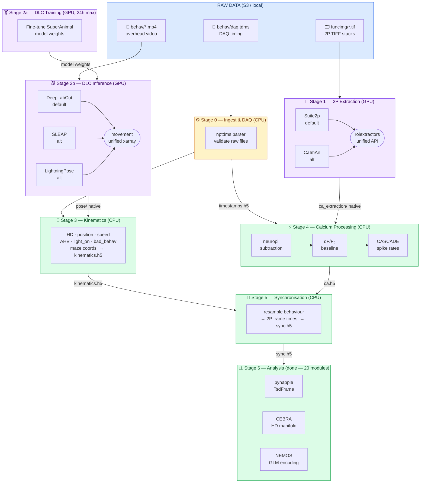
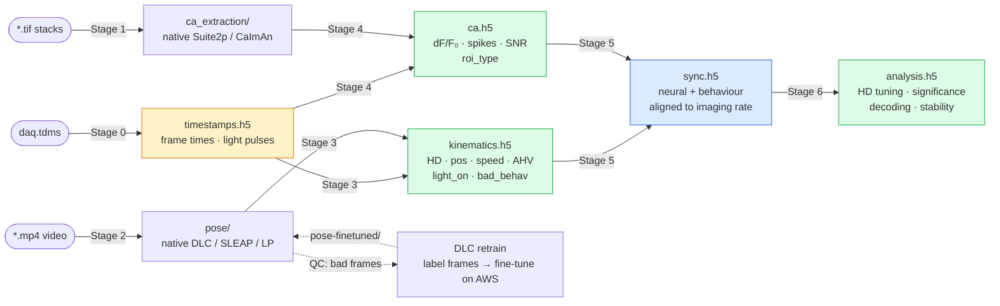
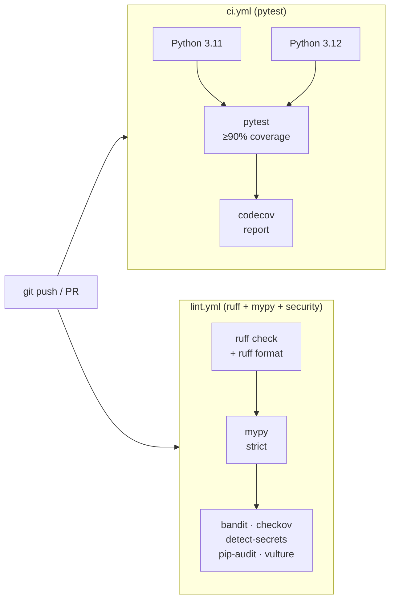

# Architecture — hm2p-v2

## System Overview

The pipeline ingests raw two-photon calcium imaging data and overhead behavioural video,
processes them independently through pluggable extractor/tracker backends, then joins them
into a synchronised per-session dataset. All data lives in AWS S3; compute runs on AWS EC2
or locally.


```mermaid
flowchart TB
    subgraph RAW["RAW DATA  (S3 / local)"]
        TIFF["🗂 funcimg/*.tif\n2P TIFF stacks"]
        MP4["🎥 behav/*.mp4\noverhead video"]
        TDMS["📡 behav/daq.tdms\nDAQ timing"]
    end

    TDMS --> S0

    subgraph S0["⚙️ Stage 0 — Ingest & DAQ  (CPU)"]
        DAQ["nptdms parser\nvalidate raw files"]
    end

    TIFF --> S1

    subgraph S1["🔬 Stage 1 — 2P Extraction  (GPU)"]
        direction LR
        S2P["Suite2p\ndefault"]
        CAI["CaImAn\nalt"]
        ROIEX(["roiextractors\nunified API"])
        S2P --> ROIEX
        CAI --> ROIEX
    end

    MP4 --> S2B

    subgraph S2A["🏋 Stage 2a — DLC Training  (GPU, 24h max)"]
        TRAIN["Fine-tune SuperAnimal\nmodel weights"]
    end

    subgraph S2B["🐭 Stage 2b — DLC Inference  (GPU)"]
        direction LR
        DLC["DeepLabCut\ndefault"]
        SLP["SLEAP\nalt"]
        LPO["LightningPose\nalt"]
        MOV(["movement\nunified xarray"])
        DLC --> MOV
        SLP --> MOV
        LPO --> MOV
    end

    S2A -->|"model weights"| S2B

    S0  -->|"timestamps.h5"| S3
    S0  -->|"timestamps.h5"| S4
    S2B  -->|"pose/ native"| S3

    subgraph S3["🏃 Stage 3 — Kinematics  (CPU)"]
        KIN["HD · position · speed\nAHV · light_on · bad_behav\nmaze coords  →  kinematics.h5"]
    end

    S1  -->|"ca_extraction/ native"| S4

    subgraph S4["⚡ Stage 4 — Calcium Processing  (CPU)"]
        direction LR
        NEU["neuropil\nsubtraction"]
        DFF["dF/F₀\nbaseline"]
        CASC["CASCADE\nspike rates"]
        NEU --> DFF --> CASC
    end

    S3  -->|"kinematics.h5"| S5
    S4  -->|"ca.h5"| S5

    subgraph S5["🔗 Stage 5 — Synchronisation  (CPU)"]
        SYNC["resample behaviour\n→ 2P frame times  →  sync.h5"]
    end

    S5  -->|"sync.h5"| ANA

    subgraph ANA["📊 Stage 6 — Analysis  (done — 20 modules)"]
        direction LR
        PYN["pynapple\nTsdFrame"]
        CEB["CEBRA\nHD manifold"]
        NEM["NEMOS\nGLM encoding"]
    end

    style RAW fill:#dbeafe,stroke:#2563eb,color:#1e3a5f
    style S0  fill:#fef3c7,stroke:#d97706,color:#78350f
    style S1  fill:#f3e8ff,stroke:#7c3aed,color:#3b0764
    style S2A fill:#f3e8ff,stroke:#7c3aed,color:#3b0764
    style S2B fill:#f3e8ff,stroke:#7c3aed,color:#3b0764
    style S3  fill:#dcfce7,stroke:#16a34a,color:#14532d
    style S4  fill:#dcfce7,stroke:#16a34a,color:#14532d
    style S5  fill:#dcfce7,stroke:#16a34a,color:#14532d
    style ANA fill:#dcfce7,stroke:#16a34a,color:#14532d
```

### Intermediate File Data Flow


```mermaid
flowchart LR
    TDMS(["daq.tdms"])         -->|Stage 0| TS["timestamps.h5\nframe times · light pulses"]
    TIFF(["*.tif stacks"])     -->|Stage 1| CAX["ca_extraction/\nnative Suite2p / CaImAn"]
    MP4(["*.mp4 video"])       -->|Stage 2| PSE["pose/\nnative DLC / SLEAP / LP"]

    TS  -->|Stage 3| KIN["kinematics.h5\nHD · pos · speed · AHV\nlight_on · bad_behav"]
    PSE -->|Stage 3| KIN

    TS  -->|Stage 4| CA["ca.h5\ndF/F₀ · spikes · SNR\nroi_type"]
    CAX -->|Stage 4| CA

    KIN -->|Stage 5| SYN["sync.h5\nneural + behaviour\naligned to imaging rate"]
    CA  -->|Stage 5| SYN

    SYN -->|Stage 6| ANAL["analysis.h5\nHD tuning · significance\ndecoding · stability"]

    PSE -.->|"QC: bad frames"| RETRAIN["DLC retrain\nlabel frames → fine-tune on AWS"]
    RETRAIN -.->|"pose-finetuned/"| PSE

    style TS  fill:#fef3c7,stroke:#d97706
    style KIN fill:#dcfce7,stroke:#16a34a
    style CA  fill:#dcfce7,stroke:#16a34a
    style SYN fill:#dbeafe,stroke:#2563eb
    style ANAL fill:#dcfce7,stroke:#16a34a
```

### Pipeline Stages

| Stage | Name | Compute | Output | Notes |
| --- | --- | --- | --- | --- |
| 0 | Ingest & DAQ | CPU | `timestamps.h5` | TDMS → frame times, light pulses; raw file validation |
| 1 | 2P Extraction | GPU | `ca_extraction/` | Suite2p (default) or CaImAn via roiextractors |
| 2a | DLC Training | GPU (24h max) | `dlc_training/models/` | Fine-tune SuperAnimal on manually labelled frames; GPU required |
| 2b | DLC Inference | GPU | `pose/` | DLC (default), SLEAP, or LightningPose via movement; depends on 2a |
| 3 | Kinematics | CPU | `kinematics.h5` | HD, position, speed, AHV, light_on, bad_behav |
| 3b | Syllables (optional) | CPU | `syllables.npz` | keypoint-MoSeq (AR-HMM) or VAME — zero-label segmentation |
| 4 | Calcium Processing | CPU | `ca.h5` | Neuropil subtraction → dF/F → CASCADE spike inference |
| 4b | CASCADE | CPU | `ca.h5` (spikes) | Calibrated spike rates (spikes/s) via cascade2p; can be re-run independently of neuropil/dF/F steps |
| 5 | Synchronisation | CPU | `sync.h5` | Resample behaviour to imaging frame times |
| 6 | Analysis | CPU | `analysis.h5` | HD tuning, significance, decoding, stability, gain |

Stage 4b is separated from Stage 4 in the runner because CASCADE can be re-run independently
(e.g. with a different model) without repeating neuropil subtraction or dF/F computation.
The `scripts/run_cascade.py` runner targets Stage 4b alone.

**Dependency chain:** Stage 2a (DLC Training) → Stage 2b (DLC Inference) → Stage 3 → Stage 3b → Stage 5 → Stage 6. Stage 4 / 4b
are independent of pose data and do not need re-running when pose is updated.

---

## Architecture Deviation — Cellpose 3 Anatomical Prior (Stage 1)

The Stage 1 extraction uses Cellpose 3 as an anatomical prior for Suite2p ROI
detection (`anatomical_only=2`). This is a deliberate deviation from a
purely activity-based detection approach.

**Rationale:** hm2p single-plane recordings contain both somatic and dendritic
ROIs in the same imaging plane. Activity-based detection (the Suite2p default)
does not distinguish between them at the detection stage; it discovers any
fluorescence signal exceeding its threshold, which includes dendritic processes
that look similar to small somata in activity space. A Cellpose 3 anatomical
prior seeds ROI candidates from a static mean/max projection image, biasing
detection toward compact, roughly circular soma morphologies before activity
statistics refine the candidate set. Post-hoc classification in
`extraction/soma_classifier.py` (using shape statistics from `stat.npy` plus
activity features from the dF/F traces) then separates retained soma and
dendrite ROIs and produces calibrated per-ROI probabilities (`p_soma`,
`p_dend`, `p_artefact`) stored in `ca.h5`. The current default is a
provisional rule-based scorer that exactly reproduces the legacy hand-tuned
thresholds; a logistic-regression replacement can be trained from curated
labels via `scripts/train_soma_classifier.py` and dropped in at
`sourcedata/trackers/suite2p/soma_classifier.pkl`. See
[docs/soma-classifier.md](docs/soma-classifier.md) for details.

**Mode 2 (default):** Cellpose seeds + activity refinement. This retains the
benefits of both approaches: anatomical shape guides initial detection, and
activity statistics filter out low-quality or contaminated candidates.

**Fallback:** Set `suite2p_anatomical_only: 0` in `config/pipeline.yaml` to
revert to activity-only detection (legacy behaviour). Cellpose is not required
in this mode.

Reference: Stringer & Pachitariu 2025. "Cellpose3: one-click image restoration
for improved cellular segmentation." Nature Methods.
doi:10.1038/s41592-025-02595-5. https://github.com/MouseLand/cellpose

---

## Component Architecture

### Source Layout

```text
hm2p-v2/
├── src/
│   └── hm2p/
│       ├── __init__.py
│       ├── cli.py                 # Command-line interface entry points
│       ├── config.py              # Pydantic settings: paths, compute profile, versions
│       ├── constants.py           # Shared constants (bin counts, thresholds, etc.)
│       ├── plotting.py            # Shared plotting utilities
│       ├── session.py             # Session dataclass, registry loading from experiments.csv
│       ├── ingest/
│       │   ├── __init__.py
│       │   ├── validate.py        # Check raw file completeness per session
│       │   └── daq.py             # TDMS → timestamps.h5 (nptdms; Stage 0)
│       ├── extraction/
│       │   ├── __init__.py
│       │   ├── base.py            # Abstract extractor interface (wraps roiextractors)
│       │   ├── suite2p.py         # Suite2pExtractor + classify_roi_types(_with_probs)
│       │   ├── soma_features.py   # Per-ROI feature extraction (shape + activity)
│       │   ├── soma_classifier.py # Soma/dend/artefact classifier framework
│       │   ├── run_suite2p.py     # Suite2p batch runner: wraps suite2p.run_s2p()
│       │   ├── zdrift.py          # Z-drift estimation from serial2p z-stacks
│       │   └── caiman.py          # CaimanExtractor
│       ├── pose/
│       │   ├── __init__.py
│       │   ├── preprocess.py      # load_meta + undistort/crop utils (videos are pre-processed)
│       │   ├── quality.py         # Pose quality metrics: PCK, likelihood, jitter
│       │   ├── retrain.py         # Helpers for DLC active-learning retraining
│       │   └── run.py             # Dispatch to DLC / SLEAP / LP based on session.tracker
│       ├── kinematics/
│       │   ├── __init__.py
│       │   ├── compute.py         # Load via movement, compute HD/position/speed/AHV
│       │   ├── perspective.py     # Parallax correction for overhead camera bodypart height
│       │   └── syllables.py       # OPTIONAL Stage 3b: VAME / keypoint-MoSeq syllable discovery
│       ├── calcium/
│       │   ├── __init__.py
│       │   ├── neuropil.py          # Neuropil subtraction (fixed coeff + FISSA)
│       │   ├── neuropil_analysis.py # Neuropil contamination QC metrics
│       │   ├── dff.py               # dF/F0 computation
│       │   ├── spikes.py            # CASCADE calibrated spike inference
│       │   ├── events.py            # Voigts & Harnett fallback event detection
│       │   ├── population.py        # Population-level calcium signal summaries
│       │   └── run.py               # Stage 4 runner: neuropil → dF/F → CASCADE → ca.h5
│       ├── analysis/
│       │   ├── __init__.py
│       │   ├── cache.py              # Analysis result caching utilities
│       │   ├── activity.py           # Active-cell detection and firing rate stats
│       │   ├── tuning.py             # HD tuning curves, PD, MVL, Rayleigh
│       │   ├── significance.py       # Circular shuffle tests for HD significance
│       │   ├── comparison.py         # Tuning curve correlation, PD shift, split-half
│       │   ├── decoder.py            # Bayesian population HD decoder
│       │   ├── stability.py          # Temporal stability, light/dark drift
│       │   ├── population.py         # Population-level summary statistics
│       │   ├── ahv.py                # Angular head velocity tuning
│       │   ├── information.py        # Spatial / directional information (Skaggs)
│       │   ├── classify.py           # Automated HD cell classification
│       │   ├── gain.py               # Light/dark gain modulation index
│       │   ├── anchoring.py          # Visual vs idiothetic HD anchoring
│       │   ├── speed.py              # Speed modulation analysis
│       │   ├── mixed_stats.py        # Cross-module statistical comparisons (Penk+ vs CamKII+)
│       │   ├── celltype_dynamics.py  # Time-resolved population dynamics by cell type
│       │   ├── rastermap_analysis.py # Rastermap-based neural population visualisation
│       │   ├── run.py                # Stage 6 runner: full analysis pipeline
│       │   └── save.py               # Write analysis.h5 outputs
│       ├── maze/
│       │   ├── __init__.py
│       │   ├── topology.py        # q-rose maze graph: 7×5 grid, adjacency, dead ends
│       │   ├── discretize.py      # Continuous x/y → maze cell assignment
│       │   └── analysis.py        # Occupancy, exploration, turn bias, sequences
│       ├── anatomy/
│       │   ├── __init__.py
│       │   ├── register.py        # brainreg: serial2p → Allen CCFv3 registration
│       │   ├── injection.py       # Injection site extraction from brainreg output
│       │   └── render.py          # 3D Plotly rendering of injection sites + atlas
│       ├── sync/
│       │   ├── __init__.py
│       │   ├── align.py           # Resample behaviour to imaging timestamps
│       │   └── validate.py        # Post-sync validation: shape, NaN, temporal monotonicity
│       ├── patching/
│       │   ├── __init__.py
│       │   ├── config.py                    # Patching pipeline configuration
│       │   ├── io.py                        # WaveSurfer H5 + SWC file I/O
│       │   ├── ephys.py                     # Electrophysiology signal processing
│       │   ├── protocols.py                 # Stimulus protocol parsing & response extraction
│       │   ├── spike_features.py            # AP waveform feature extraction
│       │   ├── morphology.py                # SWC morphology loading & analysis
│       │   ├── metrics.py                   # Intrinsic excitability & passive properties
│       │   ├── statistics.py                # Statistical comparisons (Penk vs non-Penk)
│       │   ├── pca.py                       # PCA on electrophysiological features
│       │   ├── run.py                       # Batch runner for patching analysis
│       │   └── plotting/
│       │       └── morph_plots.py           # Morphology visualisation figures
│       └── io/
│           ├── __init__.py
│           ├── hdf5.py            # Read/write all .h5 files; pandera schema validation
│           ├── nwb.py             # neuroconv wrapper: HDF5 → NWB export
│           ├── s3.py              # S3 path resolution (cloud vs local)
│           └── aws_cost.py        # AWS cost estimation and billing queries
├── tests/                         # Tests live in tests/ mirroring src/hm2p/ structure.
│   │                              # 97 test files, 1,814 tests as of March 2026.
│   │                              # See tests/ directory for details.
│   └── ...
├── workflow/
│   ├── Snakefile                  # Main DAG
│   ├── rules/
│   │   ├── ingest.smk
│   │   ├── extraction.smk
│   │   ├── pose.smk
│   │   ├── kinematics.smk
│   │   ├── calcium.smk
│   │   └── sync.smk
│   └── profiles/
│       ├── local/config.yaml      # Local CPU execution
│       ├── local-gpu/config.yaml  # Local GPU execution
│       └── aws-batch/config.yaml  # AWS Batch execution
├── config/
│   ├── pipeline.yaml              # Session-level parameters (alpha, thresholds, etc.)
│   ├── compute.yaml               # Active compute profile
│   └── patching.yaml              # Patching pipeline parameters (protocols, thresholds)
├── docker/
│   ├── gpu.Dockerfile             # Suite2p + DLC + CUDA
│   ├── cpu.Dockerfile             # movement + calcium + sync
│   └── kpms.Dockerfile            # keypoint-MoSeq isolated env
├── frontend/
│   ├── app.py                     # Streamlit entry point (st.navigation)
│   ├── data.py                    # S3 data loading, caching, session filters
│   └── pages/                     # 60 page modules (one per analysis view)
│       │                          # Notable pages: ahv_page, analysis_page, anatomy_page,
│       │                          # anchoring_page, cascade_page, classify_page, decoder_page,
│       │                          # drift_page, gain_page, hd_tuning_page, info_theory_page,
│       │                          # light_page, maze_page, moseq_page, neuropil_analysis_page,
│       │                          # patching_page, pipeline_page, place_tuning_page,
│       │                          # pop_dynamics_page, population_page, rastermap_page,
│       │                          # signal_quality_page, stability_page, tracking_quality_page,
│       │                          # zdrift_page, and others.
├── scripts/
│   │                              # Pipeline stage runners (invoke a single stage across sessions):
│   ├── run_stage0_daq.py          # Stage 0: TDMS → timestamps.h5
│   ├── run_stage3_kinematics.py   # Stage 3: pose → kinematics.h5
│   ├── run_stage4_calcium.py      # Stage 4: neuropil → dF/F → ca.h5
│   ├── run_stage5_sync.py         # Stage 5: kinematics + ca → sync.h5
│   ├── run_stage6_analysis.py     # Stage 6: sync → analysis.h5
│   ├── run_downstream_pipeline.py # Runs Stages 3 → 3b → 5 → 6 in sequence (after pose update)
│   ├── run_cascade.py             # Stage 4b: re-run CASCADE spike inference only
│   ├── run_zdrift.py              # Z-drift estimation from serial2p z-stacks
│   ├── run_kpms.py                # Stage 3b: keypoint-MoSeq syllable discovery
│   │                              # DLC retraining workflow (see DLC Retraining Pipeline section):
│   ├── prepare_retrain_frames.py  # Extract frames + create DLC project for labeling
│   ├── upload_dlc_labels.py       # Upload labeled data + config to S3
│   ├── launch_dlc_finetune_ec2.py  # Launch g4dn for DLC training + re-inference
│   ├── run_dlc_retrain.py         # Training + re-inference script (runs on EC2)
│   ├── promote_finetuned_pose.py  # Copy pose-finetuned/ → pose/ after QC
│   │                              # Infrastructure scripts (AWS setup — run once):
│   ├── setup_ec2_iam.py           # IAM roles + instance profiles for EC2
│   ├── setup_frontend_iam.py      # IAM policy for Streamlit frontend S3 access
│   ├── setup_s3_logging.py        # Enable S3 access logging
│   ├── setup_sg_lockdown.py       # Restrict EC2 security group to known IPs
│   ├── setup_ssm.py               # SSM Session Manager setup for keyless SSH
│   ├── setup_auto_shutdown.py     # Auto-shutdown idle EC2 instances
│   ├── ec2_utils.py               # EC2 helper utilities (shared by launch scripts)
│   │                              # Data transfer and utility scripts:
│   ├── upload_to_s3.py            # Bulk upload rawdata to S3
│   ├── download_from_s3.py        # Download derivatives from S3 for local analysis
│   ├── upload_patching_s3.py      # Upload patching data to S3
│   └── verify_s3_upload.sh        # Verify S3 upload checksums
├── PLAN.md
├── ARCHITECTURE.md
├── CLAUDE.md
└── pyproject.toml
```

---

## Data Flow and File Formats

### HDF5 Schema

All intermediate outputs use HDF5 with consistent indexing. Arrays are time-first
(C-contiguous) for efficient slicing into pynapple `TsdFrame`. Timestamps are float64
seconds since session start. Units and session_id are stored as HDF5 attributes.

#### `timestamps.h5` (Stage 0 output)

```text
/session_id              (str attr)
/frame_times_camera      (N,) float64 — camera frame timestamps, seconds since session start
/frame_times_imaging     (T,) float64 — 2P frame timestamps (SciScan line clock → frame end)
/fps_camera              (float attr) — nominal camera frame rate
/fps_imaging             (float attr) — nominal imaging frame rate
/light_on_times          (L,) float64 — lighting pulse-on timestamps
/light_off_times         (L,) float64 — lighting pulse-off timestamps
```

#### `kinematics.h5`

S3 path: `kinematics/{sub}/{ses}/kinematics.h5`

Attributes stored on the root group:
- `session_id`, `tracker`, `confidence_threshold`, `gap_fill_frames`,
  `scale_mm_per_px`, `orientation_deg`, `speed_active_threshold_cm_s`
- `dlc_model_name`, `dlc_snapshot` — provenance from the DLC h5 filename
- `dlc_champion_id` — stable project-wide champion identifier; see
  [docs/dlc-champion-model.md](docs/dlc-champion-model.md)

```text
/frame_times         (N,) float64 — camera frame timestamps in seconds since session start
/hd_deg              (N,) float32 — fused head direction, degrees (unwrapped, camera rate)
/hd_ears             (N,) float32 — HD from ear vector (QC)
/hd_nose_head        (N,) float32 — HD from nose→head_midpoint vector (QC)
/hd_nose_neck        (N,) float32 — HD from nose→neck vector (QC)
/hd_head_neck        (N,) float32 — HD from head→neck vector (QC)
/hd_confidence       (N,) float32 — confidence of fused HD estimate
/x_head_mm           (N,) float32 — head x position, mm
/y_head_mm           (N,) float32 — head y position, mm
/speed_head_cm_s     (N,) float32 — head speed, cm/s
/x_body_mm           (N,) float32 — body centroid x position, mm
/y_body_mm           (N,) float32 — body centroid y position, mm
/speed_body_cm_s     (N,) float32 — body centroid speed, cm/s
/x_maze              (N,) float32 — body x position, maze units (0–7)
/y_maze              (N,) float32 — body y position, maze units (0–5)
/ahv_deg_s           (N,) float32 — angular head velocity, deg/s
/active              (N,) bool    — movement state (binary; speed > threshold)
/light_on            (N,) bool    — overhead light state (1 min on / 1 min off cycle)
/bad_behav           (N,) bool    — head-mount stuck artefact mask
/x_mm                (N,) float32 — alias for x_body_mm (backward compat)
/y_mm                (N,) float32 — alias for y_body_mm (backward compat)
/speed_cm_s          (N,) float32 — alias for speed_body_cm_s (backward compat)
/bp_{kp}_x_maze      (N,) float32 — per-bodypart x in maze coords (one dataset per keypoint)
/bp_{kp}_y_maze      (N,) float32 — per-bodypart y in maze coords (one dataset per keypoint)
/syllable_id         (N,) int16   — OPTIONAL: VAME / keypoint-MoSeq syllable index (-1 = unassigned)
/syllable_prob       (N, S) float32 — OPTIONAL: posterior over S syllables
```

Maze coordinate system: the Rosenberg maze is 7 × 5 units. Maze units are derived from
pixel positions via scale calibration and video ROI crop metadata.

#### `ca.h5`

S3 path: `calcium/{sub}/{ses}/ca.h5`

Attributes: `session_id`, `fps_imaging`

```text
/frame_times         (T,) float64 — imaging frame timestamps in seconds since session start
/bad_frames          (T,) bool    — PMT dropout / bad frame mask
/roi_ids             (R,) int32   — ROI indices (matches Suite2p / CaImAn indexing)
/roi_types           (R,) uint8   — 0=soma, 1=dend, 2=artefact
/dff                 (R, T) float32 — dF/F0 per ROI per frame
/spikes              (R, T) float32 — CASCADE spike rate, spikes/s (written by Stage 4b)
/event_masks         (R, T) float32 — Voigts & Harnett binary event mask
/event_masks_sd      (R, T) float32 — SD-threshold events (Zong et al. 2022)
/deconv              (R, T) float32 — Suite2p deconvolved spikes (raw spks.npy)
/deconv_norm         (R, T) float32 — deconv normalised per ROI by max value
/snr                 (R,) float32 — signal-to-noise ratio per ROI
```

#### `sync.h5`

S3 path: `sync/{sub}/{ses}/sync.h5`

`sync/align.py` passes all kinematics.h5 datasets through unchanged (resampled to imaging
rate) and appends all ca.h5 datasets verbatim. Field names are therefore identical to those
in kinematics.h5 and ca.h5. Attributes are inherited from ca.h5 with `session_id` overridden.

Root attributes include the DLC provenance triplet copied from kinematics.h5:
`dlc_model_name`, `dlc_snapshot`, `dlc_champion_id`. See
[docs/dlc-champion-model.md](docs/dlc-champion-model.md).

Key datasets at imaging rate T (all kinematics signals resampled from camera rate N):

```text
/frame_times         (T,) float64 — imaging frame timestamps in seconds
/hd_deg              (T,) float32 — fused HD resampled to imaging rate, degrees
/ahv_deg_s           (T,) float32 — AHV resampled to imaging rate, deg/s
/x_mm                (T,) float32 — body x position, mm (alias for x_body_mm)
/y_mm                (T,) float32 — body y position, mm (alias for y_body_mm)
/x_body_mm           (T,) float32 — body centroid x position, mm
/y_body_mm           (T,) float32 — body centroid y position, mm
/speed_cm_s          (T,) float32 — body speed, cm/s (alias for speed_body_cm_s)
/x_maze              (T,) float32 — body x in maze units
/y_maze              (T,) float32 — body y in maze units
/active              (T,) bool    — movement state (nearest-neighbour resampled)
/light_on            (T,) bool    — overhead light state (nearest-neighbour resampled)
/bad_behav           (T,) bool    — head-mount stuck mask (nearest-neighbour resampled)
/bp_{kp}_x_maze      (T,) float32 — per-bodypart x in maze coords
/bp_{kp}_y_maze      (T,) float32 — per-bodypart y in maze coords
/dff                 (R, T) float32 — dF/F0, copied from ca.h5
/spikes              (R, T) float32 — CASCADE spike rate, copied from ca.h5
/event_masks         (R, T) float32 — Voigts & Harnett events, copied from ca.h5
/event_masks_sd      (R, T) float32 — SD-threshold events, copied from ca.h5
/deconv              (R, T) float32 — Suite2p deconvolved spikes, copied from ca.h5
/deconv_norm         (R, T) float32 — normalised deconv, copied from ca.h5
/roi_types           (R,) uint8   — 0=soma, 1=dend, 2=artefact
```

Note: `syllable_id` and `syllable_prob` are also resampled and included when
Stage 3b (MoSeq) has been run.

#### `analysis.h5` (Stage 6 output)

```text
/session_id          (str attr)
/signal_type         (str attr) — "dff", "deconv", or "events"
/roi_ids             (R,) int32   — ROI indices
/roi_types           (R,) uint8   — 0=soma, 1=dend, 2=artefact
/tuning_curves       (R, B) float32 — HD tuning curve per ROI (B angular bins)
/pd                  (R,) float32 — preferred direction, degrees
/mvl                 (R,) float32 — mean vector length
/rayleigh_p          (R,) float64 — Rayleigh test p-value
/is_hd               (R,) bool    — classified as HD cell
/si                  (R,) float32 — spatial / directional information (bits/spike)
/shuffle_p           (R,) float64 — circular shuffle significance p-value
/light_pd            (R,) float32 — PD during light-on epochs
/dark_pd             (R,) float32 — PD during light-off epochs
/pd_shift            (R,) float32 — PD shift (dark − light), degrees
/gain_index          (R,) float32 — light/dark gain modulation index
/mean_rate           (R,) float32 — mean firing rate (active frames)
/peak_rate           (R,) float32 — peak rate in tuning curve
/ahv_slope           (R,) float32 — AHV modulation slope
/speed_slope         (R,) float32 — speed modulation slope
/decoder_error       (float attr) — population HD decode mean absolute error, degrees
```

Root attributes include the DLC provenance triplet: `dlc_model_name`, `dlc_snapshot`,
`dlc_champion_id`, sourced from the sync.h5 that was the input to Stage 6.

---

## DLC Champion Model

The project maintains a **single project-wide champion model manifest** at
`s3://hm2p-derivatives/dlc-champion.json`. Every derivative that depends on DLC
pose data (kinematics.h5, sync.h5, analysis.h5, rendered videos) records the
`dlc_champion_id` string from this manifest as an attribute or sidecar file.

The frontend compares each session's stored `dlc_champion_id` against the current
manifest and displays a staleness warning for any session where they diverge.

Full specification: [docs/dlc-champion-model.md](docs/dlc-champion-model.md)

Key paths:

| Path | Purpose |
| --- | --- |
| `s3://hm2p-derivatives/dlc-champion.json` | Single source of truth — current champion |
| `s3://hm2p-derivatives/dlc-champion-history/` | Audit trail of superseded champions |
| `pose/{sub}/{ses}/promoted.json` | Per-session: which h5 file was selected + champion_id |
| `pose/{sub}/{ses}/*.provenance.json` | Per-video sidecar with champion_id |
| `scripts/declare_dlc_champion.py` | Promotes a new champion; called automatically by `run_dlc_retrain.py` on success |
| `scripts/promote_dlc_model.py` | Writes per-session promoted.json (run before declaring) |
| `frontend/data.py::get_dlc_champion()` | Frontend loader — cached 300 s |
| `frontend/data.py::is_session_current()` | Per-session currency check |
| `frontend/data.py::render_champion_staleness_warning()` | Shared UI warning banner |

---

## Interface Contracts

### Analysis Interface — pynapple

The HDF5 outputs are designed for direct loading into pynapple without any reshaping:

```python
import pynapple as nap, h5py

with h5py.File("sync.h5") as f:
    t = f["frame_times"][:]                              # note: plural "frame_times"
    spikes  = nap.TsdFrame(t=t, d=f["spikes"][:].T)    # (T, R)
    dff     = nap.TsdFrame(t=t, d=f["dff"][:].T)        # (T, R)
    hd      = nap.Tsd(t=t, d=f["hd_deg"][:])            # note: "hd_deg" not "hd"
    speed   = nap.Tsd(t=t, d=f["speed_cm_s"][:])        # note: "speed_cm_s" not "speed"
    active  = nap.Tsd(t=t, d=f["active"][:])

active_ep = nap.IntervalSet(...)                         # from active boolean
spikes_active = spikes.restrict(active_ep)               # timestamp-aware restriction
```

### Calcium Extraction — roiextractors API

The `extraction/` module wraps roiextractors. Any extractor class must provide:

```python
seg.get_traces(name="raw")        # → np.ndarray (n_rois, n_frames)
seg.get_traces(name="neuropil")   # → np.ndarray or None
seg.get_accepted_list()           # → list[int] — accepted ROI indices
seg.get_roi_image_masks()         # → np.ndarray (n_rois, h, w)
seg.get_sampling_frequency()      # → float — imaging Hz
```

### Pose / Kinematics — movement API

The `kinematics/` module always calls:

```python
ds = movement.io.load_poses.from_file(file=path, source_software=session.tracker)
# ds.position      shape: (time, individuals, keypoints, space)
# ds.confidence    shape: (time, individuals, keypoints)
```

Downstream functions receive `ds` and are unaware of which tracker produced it.

---

## Compute Profiles

Snakemake uses profiles to select executor and resources:

| Profile | Executor | GPU | Use case |
| --- | --- | --- | --- |
| `local` | local shell | no | CPU stages on laptop/desktop |
| `local-gpu` | local shell | yes | All stages on local GPU machine |
| `aws-batch` | AWS Batch | yes (g4dn) | Full cloud pipeline |

Set in `config/compute.yaml`:

```yaml
profile: local   # or local-gpu, aws-batch
```

---

## Storage Layout (S3)

```text
s3://hm2p-rawdata/
  rawdata/sub-{id}/ses-{date}/funcimg/
  rawdata/sub-{id}/ses-{date}/behav/
  sourcedata/

s3://hm2p-derivatives/
  derivatives/ca_extraction/sub-{id}/ses-{date}/
  derivatives/pose/sub-{id}/ses-{date}/
  derivatives/movement/sub-{id}/ses-{date}/
  derivatives/calcium/sub-{id}/ses-{date}/
  derivatives/sync/sub-{id}/ses-{date}/
  derivatives/analysis/sub-{id}/ses-{date}/
```

When running locally, the same relative paths are used under a local root directory
configured in `config/pipeline.yaml`. The `io/s3.py` module resolves paths transparently.

---

## CI / CD


```mermaid
flowchart LR
    PR["git push / PR"] --> CI & LINT

    subgraph CI["ci.yml  (pytest)"]
        PY311["Python 3.11"] & PY312["Python 3.12"] --> TEST["pytest\n≥90% coverage"]
        TEST --> COV["codecov\nreport"]
    end

    subgraph LINT["lint.yml  (ruff + mypy + security)"]
        RUF["ruff check\n+ ruff format"] --> MYP["mypy\nstrict"]
        MYP --> SEC["bandit · checkov\ndetect-secrets\npip-audit · vulture"]
    end
```

No CD (deployment) planned — pipeline is run on-demand per session batch.

---

## Key Design Decisions

| Decision | Choice | Reason |
| --- | --- | --- |
| Extraction abstraction | roiextractors | Only mature unified API across Suite2p + CaImAn |
| Kinematic abstraction | movement | Official SWC tool; supports all major trackers |
| Behavioural syllables | keypoint-MoSeq (primary), VAME v0.12+ (alt) | Both zero-label; [manual install](docs/manual-installs.md) — incompatible numpy pins |
| Intermediate format | HDF5 | Fast random access, self-describing, well-supported in Python |
| Pipeline orchestration | Snakemake | Supports local + AWS Batch without code changes |
| Data standard | NeuroBlueprint | Designed for systems neuroscience; tooling support |
| Package manager | uv | Faster than pip/conda for pure-Python envs; conda for GPU envs |

---

## Code Quality

| Tool | Purpose |
| --- | --- |
| ruff | Linting + formatting (replaces black + flake8 + isort) |
| mypy | Static type checking (strict mode) |
| pytest + pytest-cov | Unit testing + coverage (≥ 90% hard requirement) |
| hypothesis | Property-based testing for numerical functions |
| pandera | Runtime DataFrame / xarray / HDF5 schema validation |
| pre-commit | Auto-runs ruff, mypy, nbstripout before every commit |
| bandit | Security linter — flags dangerous code patterns |
| checkov | Infrastructure-as-code scanner (Dockerfiles, CI YAMLs) |
| detect-secrets | Pre-commit hook to prevent secrets from entering git |
| pip-audit | Dependency vulnerability scanner (OSV database) |

---

## DLC Retraining Pipeline

When SuperAnimal tracking quality is insufficient, the pipeline supports
fine-tuning DLC on manually labeled frames. The workflow spans local (Mac)
and cloud (AWS) steps.

### S3 layout

```text
s3://hm2p-derivatives/
  dlc-retrain/
    labeled-data/{sub}_{ses}/     ← PNG frames + CollectedData CSV/H5
    config.yaml                   ← DLC project config
    models/iteration-0/           ← fine-tuned model weights
    _retrain_progress.json        ← training + inference progress
  pose-finetuned/{sub}/{ses}/     ← re-inference results (before promotion)
```

### Scripts

| Script | Runs on | Purpose |
|--------|---------|---------|
| `scripts/prepare_retrain_frames.py` | Mac | Downloads video, extracts frames, creates DLC project, copies frames into labeled-data |
| `scripts/upload_dlc_labels.py` | Mac | Uploads labeled data + config to S3 |
| `scripts/launch_dlc_finetune_ec2.py` | Mac | Launches g4dn.xlarge for training + re-inference |
| `scripts/run_dlc_retrain.py` | EC2 | Training + re-inference (called by user-data) |
| `scripts/promote_finetuned_pose.py` | Mac | Copies pose-finetuned → pose on S3 after QC |

### Workflow

```text
1. Tracking QC page → select bad frames → "Export for Labeling"
                                           ↓
2. Mac: uv run python scripts/prepare_retrain_frames.py sub/ses 606 2093 ...
        → downloads video, extracts frames, creates DLC project
                                           ↓
3. Mac: uv run python -c "import deeplabcut; deeplabcut.label_frames('...')"
        → manually label frames in napari GUI
                                           ↓
4. Mac: uv run python scripts/upload_dlc_labels.py
        → uploads labeled-data + config.yaml to S3
                                           ↓
5. Mac: uv run python scripts/launch_dlc_finetune_ec2.py
        → launches g4dn.xlarge which runs run_dlc_retrain.py:
          a. Downloads labels from S3
          b. Runs deeplabcut.create_training_dataset(superanimal_transfer=True)
          c. Runs deeplabcut.train_network()
          d. Uploads model weights to S3
          e. Re-runs inference on all 26 sessions → pose-finetuned/
          f. Calls promote_dlc_model.py → writes pose/{sub}/{ses}/promoted.json
          g. Calls declare_dlc_champion.py → writes dlc-champion.json (auto)
          h. Self-terminates
                                           ↓
6. Frontend: compare fine-tuned vs previous in Tracking QC page
             (champion manifest already written — pipeline page shows new champion)
                                           ↓
7. Mac: uv run python scripts/run_downstream_pipeline.py
        → re-runs Stages 3 → 3b → 5 → 6 for all 26 sessions
        → each HDF5 now carries dlc_champion_id attribute
```
| vulture | Dead code detection — finds unused functions and variables |
| structlog | Structured JSON logging throughout pipeline stages |
