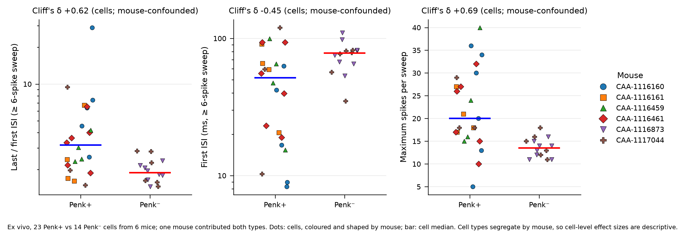
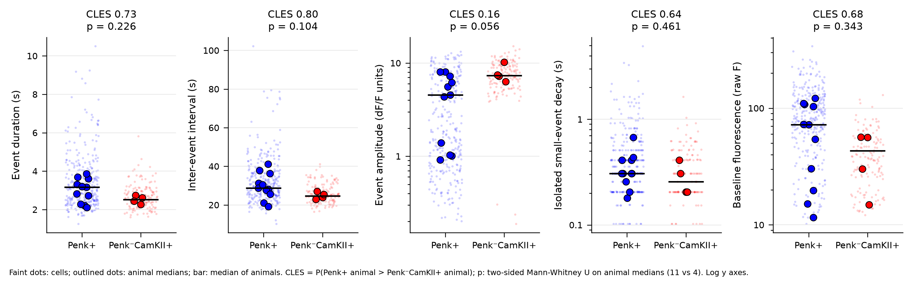
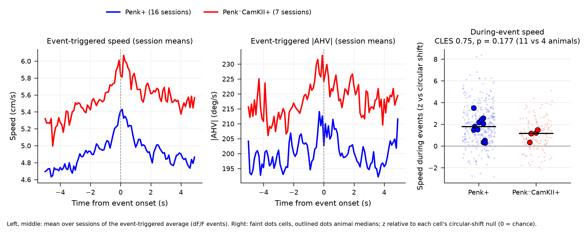
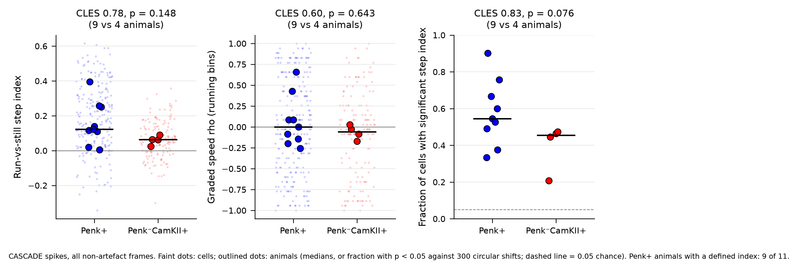
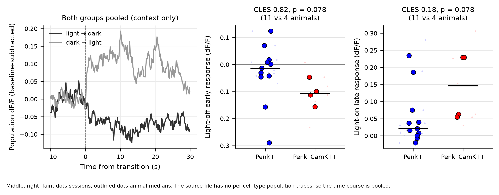
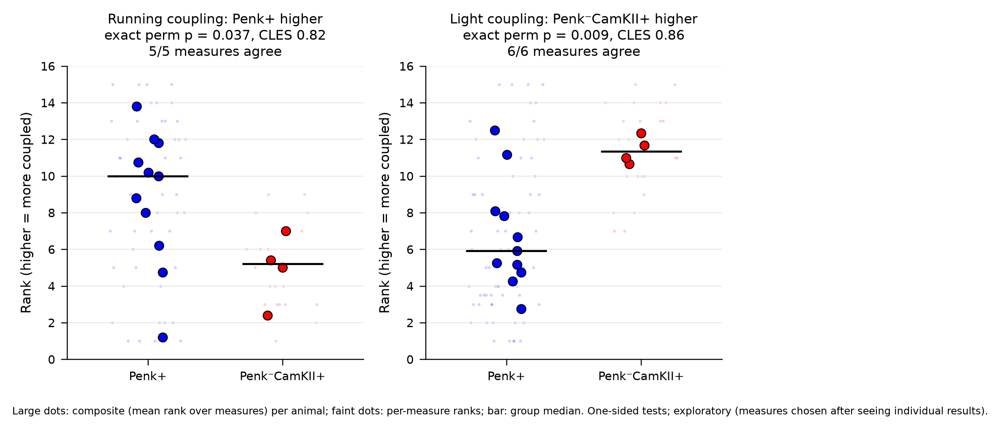

# Penk+ vs Penk⁻CamKII+ RSP neurons: results summary

Status: summary of analyses run 2026-09-25 to 2026-10-02. The full log, with
every test and the order in which decisions were made, is
[plan-penk-vs-nonpenk.md](plan-penk-vs-nonpenk.md) (§11 and follow-ups).
Where numbers differ between this summary and the log, the log is
authoritative. Figures are produced by `scripts/make_penk_figures.py`.

## Summary

Penk+ and Penk⁻CamKII+ neurons in superficial RSP differ in how they fire,
not in what navigational variable they encode. In slices, Penk+ cells have
narrower spikes, reach higher maximal firing and fire an initial
high-frequency burst that then adapts. In vivo, Penk+ calcium events are
longer and rarer than Penk⁻CamKII+ events while the decay of isolated small
events is the same, so the difference is not slower indicator clearance.
Penk+ events occur during running and turning; Penk+ activity tracks the
running state (run vs still) rather than graded speed and is sustained through
runs. Penk⁻CamKII+ activity is more strongly coupled to the room lights, with
the same direction in six separate measures. Summarised as per-animal rank
composites, running coupling is higher in Penk+ (exact permutation p = 0.037,
CLES 0.82) and light coupling higher in Penk⁻CamKII+ (p = 0.009, CLES 0.86).
These composites were defined after the individual measures were seen and are
exploratory. Head-direction tuning, population HD decoding, encoding models,
behavioural syllables and navigational coding do not differ; with 11 vs 4
animals these are bounded nulls (detectable effect about Cohen's d = 1.5), not
evidence of equivalence.

## Data and statistics

| Item | Penk+ | Penk⁻CamKII+ |
| --- | --- | --- |
| Animals (in vivo) | 11 | 4 |
| Non-excluded sessions | 16 | 7 |
| Soma ROIs | 309 | 141 |
| Ex vivo cells (mice) | 23 | 14 |

- In vivo: two-photon GCaMP imaging (~9.6 Hz, single plane) in freely moving
  mice in the Rosenberg maze with room lights alternating 1 min on / 1 min
  off. 23 sessions, 450 soma ROIs, FISSA neuropil correction. Signals: dF/F
  events and CASCADE-inferred spikes (Rupprecht et al. 2021). Penk+ is one Cre-ON-labelled type; the
  Penk⁻CamKII+ group is the Cre-OFF complement (a mixture of other excitatory
  types). One further Penk+ animal in the registry has no non-excluded
  session.
- Ex vivo: 37 RSPd layer 2/3 cells from 6 mice. Cell types are segregated by
  mouse: four mice gave only Penk+ cells, one only Penk⁻ cells, one both (3
  Penk+, 6 Penk⁻). The animal-level comparison is effectively 5 vs 2 mice and
  its permutation p cannot fall below about 0.13.
- The two in vivo populations are never in the same animal, so inference is at
  the animal level. Each result is reported at four levels: naive cell-level
  (descriptive), animal-level Mann-Whitney U, animal-level cluster
  permutation, and a linear mixed model (not available in this run; see
  Limitations). The sign must survive leaving out each Penk⁻CamKII+ animal
  (LOAO). Effect size is the common-language effect size CLES = P(Penk+ animal
  > Penk⁻CamKII+ animal); 0.5 means no difference. FDR (Benjamini-Hochberg)
  is applied within pre-declared families.
- With 11 vs 4 animals, 80 % power requires d ≈ 1.5, and an exact two-sided
  animal-level Mann-Whitney test cannot go below p = 2/1365 ≈ 0.0015.
- All tests are non-parametric (Mann-Whitney U, Wilcoxon signed-rank,
  Spearman, permutation, circular-shift nulls).
- The two composite scores (Result 5) were built after the individual measures
  had been seen. On this dataset they are exploratory. Their definitions are
  now fixed and will be applied unchanged to new animals.

Figure statistics are recomputed from animal medians (two-sided exact
Mann-Whitney U, CLES). The programme reports summarise each animal by its cell
mean, so figure p values can differ from the values in the text and tables,
which come from the programme reports.

## Results

### 1. Intrinsic physiology ex vivo: narrower spikes, higher maximal rate, burst then adapt

*Ex vivo spike-frequency adaptation. Cells coloured and shaped by mouse; bars
are cell medians. Cliff's δ is computed on cells and cannot be separated from
mouse identity.*

Penk+ cells fire narrower spikes, reach higher maximal spike counts and adapt
more than Penk⁻ cells. On the first sweep with at least six spikes, Penk+
cells start with a shorter first inter-spike interval and then slow down.

| Measure (cell medians) | Penk+ | Penk⁻ | Cliff's δ | Cell MWU p | Animal perm p |
| --- | --- | --- | --- | --- | --- |
| Spike half-width (ms) | 1.8 | 2.45 | −0.78 | < 0.001 | — |
| Maximum spikes per sweep | 20 | 13.5 | +0.69 | < 0.001 | 0.14 |
| Input capacitance | about half | | −0.66 | < 0.001 | — |
| Input resistance (MΩ) | 150 | 119 | +0.37 | ns | 0.23 |
| Rheobase (pA) | 70 | 90 | −0.30 | ns | — |
| Last / first ISI (≥ 6-spike sweep) | 3.2 | 1.9 | +0.62 | 0.002 | 0.26 |
| Adaptation index | 0.088 | 0.051 | +0.48 | 0.017 | 0.13 |
| First ISI, ≥ 6-spike sweep (ms) | 52 | 78 | −0.45 | 0.025 | 0.07 |
| First ISI, max-spike sweep (ms) | 15 | 35 | −0.68 | < 0.001 | 0.14 |

The cell-level effects are large, but none can be separated from animal
identity with these recordings; mixed models with animal as a random effect
leave nothing significant.

**Penk+ cells are not the RSP low-rheobase (LR) type.** The phenotype moves in
the LR direction (narrow spikes, higher input resistance, lower rheobase), and
12 of 23 Penk+ cells versus 1 of 14 Penk⁻ cells meet three of five LR criteria
from Brennan et al. 2020 (Fisher p = 0.011, descriptive). Three observations
argue against an LR identity: (i) LR cells show little adaptation, whereas
Penk+ cells adapt more than Penk⁻ cells; (ii) absolute values are far from LR
values (input resistance 150 vs ~400 MΩ, half-width 1.8 vs ~0.55 ms); (iii)
most patched cells are in dysgranular RSP, while LR cells dominate granular
RSP. The lower rheobase is consistent with smaller cell size: rheobase × input
resistance is about 10.5 mV in Penk+ and 10.7 mV in Penk⁻ cells (a
steady-state estimate). The working description is a smaller, narrower-spiking
layer 2/3 pyramidal cell that fires a burst and then adapts.

### 2. Calcium event signature: longer, rarer events with equal indicator kinetics

*Animal medians (outlined) over cells (faint). Log axes for amplitude, decay
and baseline fluorescence.*

Penk+ calcium events are longer and rarer than Penk⁻CamKII+ events.

| Metric (animal means) | Penk+ | Penk⁻CamKII+ | Animal p | Perm p | FDR | CLES |
| --- | --- | --- | --- | --- | --- | --- |
| Event duration (s) | 3.27 | 2.63 | 0.078 | 0.010 | 0.061 | 0.82 |
| Inter-event interval (s) | 30.9 | 25.4 | 0.040 | 0.007 | 0.061 | 0.86 |
| Event decay time (s) | 2.43 | 2.00 | 0.078 | 0.011 | 0.061 | 0.82 |
| Event amplitude (dF/F units) | 4.6 | 7.8 | 0.026 | 0.044 | 0.106 | 0.11 |
| Event SNR | 11.5 | 11.0 | 0.57 | 0.81 | 0.81 | 0.39 |
| CASCADE expected spikes per frame (x fps for Hz; pending re-run) | 0.13 | 0.19 | 0.078 | 0.063 | 0.13 | 0.18 |

Every direction survives LOAO. Event SNR does not differ.

- **Indicator kinetics are equal.** Isolated small events (no other event
  within 10 s, amplitude at or below the cell median) decay with the same time
  constant in both groups (median 0.31 vs 0.31 s; baseline-matched 0.34 vs
  0.35 s, p = 0.70). Longer Penk+ events therefore reflect longer firing
  episodes, not slower calcium clearance.
- **Penk+ cells are about twice as bright.** Baseline raw fluorescence (cell
  medians) is 84 vs 37, plausibly from the different Cre-ON and Cre-OFF
  constructs.
- **Matched re-tests.** Duration and inter-event interval keep their direction
  on spike-rate-matched and baseline-matched subsets (CLES 0.70–0.82) but lose
  significance (p 0.09–0.24). Smaller amplitude is strongest on
  baseline-matched cells (4.3 vs 7.9, MWU p = 0.006) and disappears on
  rate-matched cells (p = 0.58), so it tracks firing rate rather than
  expression.
- **The lower Penk+ rate is partly an expression effect.** Within Penk+,
  brighter cells have lower CASCADE rates (Spearman rho −0.42; +0.24 in
  Penk⁻CamKII+). The "Penk+ fire less" result is treated as unconfirmed.
- Event amplitude is bimodal across Penk+ animals: the four ADD3 animals with
  the highest baseline fluorescence have median amplitudes of about 1, the
  other seven 4.3–8.0, overlapping Penk⁻CamKII+.

### 3. Behavioural correlates: events during running and turning, coding run state

*Left and middle: event-triggered speed and |AHV|, mean over sessions (the
offset between groups reflects session-level speed, not the event response).
Right: during-event speed relative to each cell's circular-shift null.*

Penk+ events occur while the mouse is running and turning. Relative to each
cell's own circular-shift null, during Penk+ events speed z = 1.8, movement
z = 1.9 and |AHV| z = 0.8 (animal-level Wilcoxon p = 0.001–0.002, 11
animals); about half of Penk+ cells are individually significant for speed and
movement. Penk⁻CamKII+ events also accompany movement, less strongly (speed
z 1.1, movement z 1.3; between-group CLES 0.77–0.80, not significant).

*Run-vs-still step index and graded speed correlation (CASCADE spikes, all
non-artefact frames), and fraction of cells per animal with a significant step
index.*

Penk+ activity signals the running state, not graded speed.

| Measure | Penk+ | Penk⁻CamKII+ | Notes |
| --- | --- | --- | --- |
| Cells with significant run-vs-still step (spikes) | 63 % | 40 % | Penk+ animal Wilcoxon p = 0.004 |
| Same on dF/F | 47 % | 35 % | Penk+ p = 0.003 |
| Graded speed correlation across running bins | chance | chance | |
| Early vs late within-run index | ≈ 0 | ≈ 0 | activity sustained through runs |
| Summed activity vs run length (rho) | 0.22 | — | Penk+ animal Wilcoxon p = 0.004 |
| Between groups, step index | CLES 0.81 (spikes), 0.82 (dF/F) | | permutation p 0.21–0.24 |

Nine of 11 Penk+ animals had cells with a defined step index on CASCADE spikes.

- **The corridor bias is explained by running.** Penk+ event onsets are biased
  to corridors (z = 0.43, p = 0.019), but at matched running speed the
  corridor-vs-junction index is near zero in both groups (median −0.015), and
  significant cells split in both directions. The fast-vs-slow movement index
  is positive in Penk+ both in corridors (0.067, p = 0.002) and at junctions
  (0.035, p = 0.042), and leans Penk+ between groups in corridors (0.064 vs
  0.028, CLES 0.84, permutation p = 0.12). This runner used moving frames
  only, so it contrasts fast with slow movement; the step-index analysis above
  uses all frames. Brightness does not explain the running effect (within
  Penk+ rho = 0.11 with baseline fluorescence; baseline-matched Penk+ p =
  0.003).
- **Event duration is not set by running intensity** (per-cell rho between
  event duration and speed during the event 0.06, p = 0.07).
- **No difference in other behavioural correlates.** Responses aligned to
  light-on, junction entry, dead-end entry and movement onset/offset occur in
  both groups (9–19 % of cells, above the 5 % chance rate) and do not differ
  (all FDR ≥ 0.45). Egocentric boundary tuning (7 % vs 10 %) and head-body
  angle tuning (6 % vs 7 %) are near chance. Wall distance is above chance in
  Penk+ (13 % of cells) and leans Penk+ (CLES 0.89, p = 0.09) but covaries
  with corridor running. Slow temporal drift is present in about 35 % of cells
  in both groups (population-vector similarity falls with time separation in
  86–88 % of sessions; Rubin et al. 2015 test) and does not differ (all
  FDR ≥ 0.31).
- AHV modulation depth is larger in Penk⁻CamKII+ (0.19 vs 0.36, animal
  p = 0.040), but the amplitude-normalised index does not differ (p = 0.76),
  so this difference tracks event amplitude.

### 4. Light coupling leans Penk⁻CamKII+ across six measures

*Left: population response to light transitions, pooled over both groups (the
result file is not split by cell type). Middle, right: session values (faint)
and animal medians (outlined) of the early light-off and late light-on
responses.*

Penk⁻CamKII+ activity is more strongly coupled to the room lights. No single
measure is significant after FDR at the animal level, but all six lean the same
way.

| Measure | Penk+ | Penk⁻CamKII+ | Animal p | Perm p | CLES |
| --- | --- | --- | --- | --- | --- |
| Light modulation index (H3.5) | 0.097 | 0.195 | 0.056 | 0.27 | 0.16 |
| Stationary-light mean dF/F | 0.085 | 0.188 | 0.010 | 0.014 | 0.07 |
| Loss of speed-matched AHV depth in dark | −0.03 | −0.18 | 0.018 | 0.058 | 0.91 |
| Light-off early response (dF/F) | −0.031 | −0.096 | 0.078 | 0.135 | 0.82 |
| Light-on late response (dF/F) | 0.053 | 0.155 | 0.056 | 0.094 | 0.16 |
| GLM light share of deviance (dF/F) | 0.25 | 0.39 | 0.026 | 0.12 | 0.11 |
| Event onsets in light (z) | 0.53 | 1.12 | 0.026 | 0.042 | 0.11 |

The CLES column is P(Penk+ > Penk⁻CamKII+); for the AHV-loss and light-off rows
a value above 0.5 means a smaller change in Penk+. The GLM light share does not
reappear on CASCADE spike counts (0.20 vs 0.17), and the GLMs explain almost
no held-out deviance, so that row is descriptive. The light-off and light-on
responses come from the same transitions, and the composite (Result 5) counts
them as two of six measures.

### 5. Composite scores

*Composite rank per animal (large dots) and the per-measure ranks it averages
(faint dots). Higher = more coupled.*

For each measure, the animal median is oriented so that higher means more
coupled, ranked across the 15 animals, and averaged across measures.

| Composite | Measures | Median rank (higher vs other group) | CLES | One-sided MWU p | Exact permutation p | LOAO | Measures agreeing |
| --- | --- | --- | --- | --- | --- | --- | --- |
| Running coupling (Penk+ > Penk⁻CamKII+) | movement modulation; fast vs slow movement in corridors; speed and movement during events; run-vs-still step | 10.0 vs 5.2 | 0.82 | 0.039 | 0.037 | stable | 5 / 5 |
| Light coupling (Penk⁻CamKII+ > Penk+) | event onsets at light-on; light modulation; light-on sustained; light-off drop; AHV loss in dark; GLM light share | 11.3 vs 5.9 | 0.86 | 0.020 | 0.009 | stable | 6 / 6 |

The permutation is exact over all C(15, 4) = 1365 label assignments. The two
composites are uncorrelated across animals (Spearman rho = −0.08), so they
describe separate properties. Both directions hold within each equipment
configuration, and every Penk⁻CamKII+ animal ranks above 10.6 on light
coupling. With Bonferroni correction for the two composites, permutation p is
0.074 (running) and 0.018 (light).

### 6. What does not differ

These are bounded nulls. With 11 vs 4 animals, effects smaller than about
d = 1.5 would usually be missed.

| Analysis | Result |
| --- | --- |
| HD tuning (MVL, tuning width, visual dependence, HD-cell fraction) | no difference (all p > 0.17) |
| Population HD decoding, 8 cells per session | at chance in both (median error 89° vs 87°, p = 0.41) |
| PCA / ring topology (Chaudhuri et al. 2019) | angle–HD correlation ≈ 0 in both |
| Poisson GLMs (HD, AHV, speed, position, light) | held-out deviance explained ≈ 0 in both, on dF/F and on spike counts |
| Movement onset/offset dynamics (transient, sustained, immobility decay) | p > 0.49 |
| Behavioural syllable information (keypoint-MoSeq) | 0.058 vs 0.045 bits, animal p = 0.41 |
| Junction-choice decoding, place information, familiarity | null in both (p > 0.34) |
| Population coupling (Okun et al. 2015), noise correlations | lean Penk+ (CLES 0.73–0.77), p ≥ 0.09 |
| Omnibus classifier on 55 features | above chance pooled (0.69), at chance after removing animal means (0.45) |

The heterogeneity analysis found one difference that survives removal of
animal means: Penk+ cells are more dispersed in feature space within animals
than Penk⁻CamKII+ cells (dispersion ratio 0.80, permutation p = 0.003). This
is the opposite of the prior expectation that a single transcriptomic type
would be the more compact population.

## Interpretation

These points are interpretations of the results above, not additional results.

1. **Penk+ cells as a sparse, sustained run-state population.** Rare,
   seconds-long calcium events that coincide with running, follow the run/still
   state rather than speed, and persist through a run fit a population that
   reports the state "the animal is running" rather than a continuous
   variable. A 3 s event is about the length of one corridor run.
2. **Penk⁻CamKII+ cells are more coupled to visual input.** This fits a
   mixture of excitatory types that includes cells receiving visual or
   landmark input, as reported for dysgranular RSP (Jacob et al. 2017).
   Because the composites were defined post hoc and the two groups were
   labelled with different constructs, this is a lead for confirmation, not an
   established property.
3. **Link to burst firing (speculative).** The ex vivo burst-then-adapt mode
   would produce clustered spikes at the start of a drive, which matches the
   bursty in vivo rate statistics. Neuropeptide release from dense-core
   vesicles generally requires high-frequency or burst firing (van den Pol
  2012), so Penk+ cells
   could release enkephalin during runs. Enkephalin acts on δ and μ opioid
   receptors on PV and SST interneurons and reduces their GABA release, which
   would disinhibit nearby pyramidal cells. None of this has been tested in RSP,
   and nothing in the present data measures peptide release.

## Limitations

- **Animals.** 11 Penk+ vs 4 Penk⁻CamKII+ animals. Most between-group
  results lean consistently but are not significant alone; only large effects
  are detectable.
- **Construct confound and brightness.** Penk+ cells were labelled with Cre-ON
  constructs (four variants) and Penk⁻CamKII+ cells with a Cre-OFF construct.
  Penk+ cells are about twice as bright at baseline. Isolated-event decay rules
  out an indicator-kinetics explanation for event duration, but amplitude,
  inferred rate and the light composite are not controlled for construct.
- **Patching segregated by mouse.** Ex vivo cell types come from largely
  separate mice (effectively 5 vs 2), so cell-level effects cannot be separated
  from animal identity.
- **Camera handedness.** The overhead image is assumed unmirrored (camera
  default). Only side-specific labels (left/right turns, egocentric left/right)
  depend on this; no between-group comparison does.
- **CASCADE** was trained on ground truth from other cell types and indicators;
  inferred rates are approximate, and the rate difference partly tracks
  brightness.
- **Composites are exploratory.** Their measures were chosen after the
  individual results were seen.
- **Measures share data.** Light-on and light-off responses come from the same
  transitions; speed and movement during events come from the same events.
- **No mixed models in this run.** The LMM/ICC level of the four-level
  reporting could not be computed because `statsmodels` is not installed in the
  analysis environment.
- **Running and visual flow are confounded** in a freely moving animal, so the
  running result does not exclude a contribution from optic flow.
- Imaging depth and anterior–posterior position are not recorded per session.

## Next steps

1. **Record more Penk⁻CamKII+ animals** and apply the two composites with their
   fixed definitions as the primary confirmatory test.
2. **Paired slice recordings** of Penk+ and Penk⁻ cells in the same slices,
   to separate cell type from animal for spike width, maximal rate and
   adaptation.
3. **Head-fixed treadmill imaging** with controlled visual flow, to separate
   running from optic flow and light from movement.
4. **Construct-matched labelling** (same promoter and indicator in both groups,
   or dual-colour labelling in one animal) to remove the brightness and
   construct confound.

## Methods pointers

Result directories are under `results/` (gitignored, local).

| Analysis | Module | Runner | Results |
| --- | --- | --- | --- |
| Event kinetics, feature table (H2) | `hm2p.analysis.cell_features` | `run_celltype_programme.py h2` (`--signal spikes` for CASCADE) | `celltype_programme/h2/`, `celltype_programme_spikes/` |
| Indicator/expression controls | `hm2p.analysis.indicator_controls` | `run_celltype_programme.py ctl` | `celltype_programme_ctl/ctl/` |
| AHV (H3) | `hm2p.analysis.ahv` | `run_celltype_programme.py h3` | `celltype_programme/h3/` |
| Light transitions (H5) | `hm2p.analysis.transitions` | `run_celltype_programme.py h5` | `celltype_programme/h5/` |
| Heterogeneity (H6) | `hm2p.analysis.heterogeneity` | `run_celltype_programme.py h6` | `celltype_programme/h6/`, `celltype_programme_centered/` |
| Population decoding, topology (H7) | `hm2p.analysis.decoder`, `hm2p.analysis.topology` | `run_celltype_programme.py h7` | `celltype_programme/h7/` |
| Encoding models (H8) | `hm2p.analysis.encoding` | `run_celltype_programme.py h8` | `celltype_programme/h8/` |
| Coupling (H9) | `hm2p.analysis.coupling` | `run_celltype_programme.py h9` | `celltype_programme/h9/` |
| State dynamics, syllables, navigation (H4, H10) | `hm2p.analysis.state_dynamics`, `hm2p.maze.neural` | `run_celltype_programme.py h4`, `h10` | `celltype_programme/h4/`, `h10/`, `celltype_programme_syll/` |
| Event-aligned responses | `hm2p.analysis.event_aligned` | `run_celltype_programme.py evt` | `celltype_programme_evt/` |
| Event-triggered behaviour | `hm2p.analysis.event_triggered_behaviour` | `run_celltype_programme.py etb` (`scripts/celltype_extra_etb.py`) | `celltype_programme_etb/etb/` |
| Egocentric coding | `hm2p.analysis.egocentric` | `run_celltype_programme.py ego` | `celltype_programme_ego/` |
| Temporal context | `hm2p.analysis.temporal_context` | `run_celltype_programme.py tctx` | `celltype_programme_tctx/` |
| Corridor vs running | `hm2p.analysis.location_running` | `run_celltype_programme.py locrun` | `celltype_programme_locrun/` |
| Running-coding shape | (`scripts/celltype_extra_runshape.py`) | `run_celltype_programme.py runshape` | `celltype_programme_runshape/runshape/` |
| Composite scores | — | `scripts/run_celltype_composites.py` | `celltype_programme_composite/` |
| Ex vivo LR classification, PCA | `hm2p.patching.lr_classify`, `hm2p.patching.statistics` | `scripts/run_patching_celltype.py` | `patching/celltype_programme/` |
| Ex vivo adaptation | `hm2p.patching.adaptation` | `scripts/run_patching_adaptation.py` | `patching/celltype_programme/adaptation_*` |
| Animal-level statistics, LOAO | `hm2p.analysis.mixed_stats` | all of the above | — |
| Figures in this document | — | `scripts/make_penk_figures.py` | `docs/figures/penk/` (PNG), `docs/figures/penk/data/` (plotted data, JSON) |

## References

- Brennan EKW, Sudhakar SK, Jedrasiak-Cape I, John TT, Ahmed OJ. 2020.
  "Hyperexcitable Neurons Enable Precise and Persistent Information Encoding
  in the Superficial Retrosplenial Cortex." Cell Reports 30:1598–1612.
  doi:10.1016/j.celrep.2019.12.093 (LR criteria used here are approximate
  values; to be checked against the published tables before publication.)
- Jacob PY, Casali G, Spieser L, Page H, Overington D, Jeffery K. 2017. "An
  independent, landmark-dominated head-direction signal in dysgranular
  retrosplenial cortex." Nature Neuroscience 20:173–175. doi:10.1038/nn.4465
- Rupprecht P, Carta S, Hoffmann A, et al. 2021. "A database and deep learning
  toolbox for noise-optimized, generalized spike inference from calcium
  imaging." Nature Neuroscience 24:1324–1337. doi:10.1038/s41593-021-00895-5.
  https://github.com/HelmchenLabSoftware/Cascade (DOI taken from the link in the
  coding-candidates report; full reference not listed there.)
- Rubin A, Geva N, Sheintuch L, Ziv Y. 2015. "Hippocampal ensemble dynamics
  timestamp events in long-term memory." eLife 4:e12247.
  doi:10.7554/eLife.12247 (DOI taken from the link in the coding-candidates
  report; full reference not listed there.)
- Okun M, Steinmetz NA, Cossell L, et al. 2015. "Diverse coupling of neurons
  to populations in sensory cortex." Nature 521:511–515.
  doi:10.1038/nature14273
- Chaudhuri R, Gerçek B, Pandey B, Peyrache A, Fiete I. 2019. "The intrinsic
  attractor manifold and population dynamics of a canonical cognitive circuit
  across waking and sleep." Nature Neuroscience 22:1512–1520.
  doi:10.1038/s41593-019-0460-x
- van den Pol AN. 2012. "Neuropeptide transmission in brain circuits." Neuron.
  Cited in the coding-candidates report by link only; DOI not verified.
