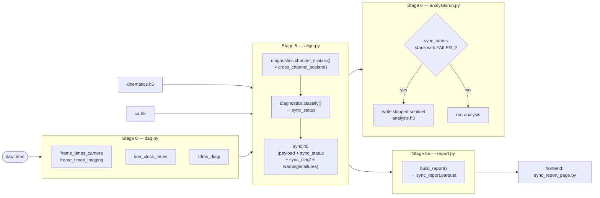

# Sync Pipeline Diagnostics & Report — Design Specification

_Status: design — not yet implemented._
_Last updated: 2026-04-30._
_Branch: `feat/soma-extraction-improvements`._
_Parallel work: Wave 5 (ROI curation page) — do **not** touch
`frontend/pages/roi_curation_page.py`, `src/hm2p/extraction/curation.py`, or
`tests/extraction/test_curation.py`. Sync work is confined to the modules and
files listed in §1._

This document specifies two coupled changes:

1. **Sync-pipeline diagnostics** — Stage 0 and Stage 5 emit per-session
   diagnostic scalars and pulse-train arrays into `timestamps.h5` and
   `sync.h5`, classify each session into a `sync_status`, and refuse
   downstream consumption when the classification is a hard failure.
2. **A single Streamlit report page** that replaces the existing 4-tab
   `frontend/pages/sync_page.py` with a unified per-session sync-status
   report.

Inputs to this design: the neuro-data-scientist's failure-modes catalogue,
proposed scalars, time-series, and 9-tier `sync_status` classification.

---

## 1. Module / file plan

| Status | File | Responsibility |
| --- | --- | --- |
| modify | `src/hm2p/ingest/daq.py` | Stage 0 — emit pulse trains + `tdms_diag/` group, never silently swallow detection issues |
| **new** | `src/hm2p/sync/diagnostics.py` | Pure functions computing all diagnostic scalars and the `sync_status` tier |
| modify | `src/hm2p/sync/align.py` | Run diagnostics, classify status, persist `sync_status` + `sync_diag/` + warnings/failures JSON; refuse to write a "passed" sync.h5 when criteria are violated |
| **new** | `src/hm2p/sync/report.py` | Aggregate sync_diag attrs across all sessions → `derivatives/sync_report/sync_report.parquet` |
| modify | `src/hm2p/io/hdf5.py` | Schema validators for the new `timestamps.h5` and `sync.h5` keys; new `validate_sync_report_parquet` |
| **new** | `config/sync.yaml` | Tunable thresholds for each diagnostic and tier predicate |
| **new** | `workflow/rules/sync_report.smk` | Snakemake rule writing `sync_report.parquet` (Stage 5b) |
| modify | `workflow/rules/ingest.smk` | Pass new diag config; outputs unchanged path but new schema |
| modify | `workflow/rules/sync.smk` | Pass `config/sync.yaml`, depend on `timestamps.h5` |
| **new** | `frontend/components/sync_diag.py` | Shared Plotly components: pulse-train raster, cumulative-count line, ISI histogram, light-cycle strip |
| modify | `frontend/data.py` | `is_sync_clean(sync_attrs) -> tuple[bool, str]` and `load_sync_report()` cached loader |
| **replace** | `frontend/pages/sync_page.py` | Renamed to `frontend/pages/sync_report_page.py`; old file deleted in same commit |
| modify | `src/hm2p/analysis/run.py` | Stage 6 entry guard: refuse `FAILED_*` sessions unless override flag set |
| modify | `tests/ingest/test_daq.py`, `tests/sync/test_align.py`, `tests/sync/test_validate.py` | Fixtures + new unit + property tests; see §6 |
| **new** | `tests/sync/test_diagnostics.py` | Unit + property tests for the diagnostics module |
| **new** | `tests/sync/test_report.py` | Unit tests for the aggregator |
| **new** | `tests/frontend/test_sync_report_page.py` | Smoke tests for the page (pytest-streamlit if available; otherwise import-only) |

### 1.1 `src/hm2p/sync/diagnostics.py`

Pure-function module with **no I/O**. Every function takes numpy arrays and a
threshold dict; returns a dataclass or a numpy array. Three groups:

```python
# Per-channel scalars (median ISI, MAD, CV, % missing pulses, drift slope, …)
def channel_scalars(times: np.ndarray, fps_nominal: float, *, cfg) -> ChannelScalars: ...

# Cross-channel scalars (cam–imaging duration overlap, start offset, end offset, light duty cycle, …)
def cross_channel_scalars(cam: np.ndarray, img: np.ndarray, light_on: np.ndarray,
                          light_off: np.ndarray, *, cfg) -> CrossChannelScalars: ...

# sync_status classifier — tier predicates from §3
def classify(scalars: SyncScalars, *, cfg) -> tuple[str, list[str], list[str]]: ...
# returns (status, warnings, failures); `warnings`/`failures` are short codes
# resolved to user-readable text by a small LUT in the same module.

# Linear drift estimator: regress pulse index → time, return slope (s/s) and R²
def drift_slope(times: np.ndarray) -> tuple[float, float]: ...
```

Depends on: numpy, scipy.stats. Imported by `sync/align.py` and tests only.

### 1.2 `src/hm2p/ingest/daq.py` — Stage 0 changes

Currently emits four arrays (`frame_times_camera`, `frame_times_imaging`,
`light_on_times`, `light_off_times`) plus `fps_camera`, `fps_imaging` attrs.
After this change Stage 0 also emits:

- A `line_clock_times` (M,) float64 dataset — every SciScan line-clock rising
  edge, *not* decimated to frames. The frontend ISI raster needs this; the
  drift estimate uses it; the off-by-one heuristic disappears once the raw
  line clock is available.
- A `tdms_diag/` HDF5 group with channel-level metadata that ingest already
  has but currently throws away (see §2).

Stage 0 **fails closed** on conditions it currently handles silently:

| Condition | Old behaviour | New behaviour |
| --- | --- | --- |
| Zero camera trigger pulses | Raises `ValueError` | Same; this stays fatal |
| Zero line-clock pulses | Silent: `sci_frame_idxs = empty array` | Raise `ValueError("No SciScan line-clock pulses")` |
| `len(line_idxs) % y_pix != 0` | Silent decimation | Record `tdms_diag/sci_lines_truncated_n` (residual count) and continue |
| `len(light_on) != len(light_off)` | Silent — used as-is | Record both counts; ingest still succeeds (sync stage classifies) |
| `cam_data` not in `{0, 1}` saturated | Silent | Record `tdms_diag/cam_min`, `tdms_diag/cam_max` for downstream margin check |

Ingest never raises on light-channel issues, since some sessions may legitimately
end mid-cycle. Status assignment is the sync stage's responsibility.

Public API unchanged: `parse_tdms()` and `run()` keep current signatures.
The returned dict gains keys; `write_timestamps_h5` writes them.

### 1.3 `src/hm2p/sync/align.py` — Stage 5 changes

Failure-closed semantics: `align.run()` now does the following in order:

1. Read `kinematics.h5`, `ca.h5`, **and** the corresponding `timestamps.h5`
   (looked up via the kinematics path's `{sub}/{ses}` — Stage 0 always writes
   it before Stage 3, so it must exist; if missing, classify as
   `FAILED_NO_TIMESTAMPS` and write a sync.h5 stub containing only the
   classification + warnings).
2. Compute all scalars from `diagnostics.py`.
3. Classify into `sync_status` (§3).
4. Write `sync.h5` with the existing payload **plus** the
   `sync_status` attr, the `sync_diag/` group, and JSON-encoded
   `sync_warnings` / `sync_failures` lists.
5. **If status starts with `FAILED_`**, omit the resampled signals from
   the file (write only the classification + diagnostics) and exit with code
   0 — Snakemake still treats the rule as successful so downstream stages
   know the file exists, but the entry guard in §5 refuses to consume it.

This makes Stage 5 a one-stop shop for sync verdicts. The legacy
`sync/validate.py` becomes a thin shim around `diagnostics.py` (kept so the
old `validate_timestamps()` signature still works for any external caller;
internally it just wraps `diagnostics.classify()`).

### 1.4 `src/hm2p/sync/report.py` — Stage 5b aggregator

Single function:

```python
def build_report(sync_dir: Path | str, output_path: Path) -> None:
    """Walk derivatives/sync/ and write sync_report.parquet (one row per session)."""
```

Reads root attrs from every `sync.h5` — does **not** open the heavy datasets.
Each row contains: `exp_id`, `sub`, `ses`, `sync_status`, every scalar
in `sync_diag/`, the warnings/failures lists, and a `read_error` column for
any session whose attrs couldn't be read.

Snakemake invocation (`sync_report.smk`):

```
rule sync_report:
    input:  expand(f"{DATA_ROOT}/derivatives/sync/{{sub}}/{{ses}}/sync.h5", zip, ...)
    output: f"{DATA_ROOT}/derivatives/sync_report/sync_report.parquet"
    shell:  "python -c 'from hm2p.sync.report import build_report; build_report(...)'"
```

The aggregator must run after **every** session's Stage 5 completes; it does not
need re-running when only one session changes (it's cheap — < 1 s for 26
sessions).

### 1.5 `frontend/pages/sync_report_page.py` — replacement

Deletes `frontend/pages/sync_page.py` in the same commit (no parallel
maintenance). New page is a single scrolling layout with three vertical
sections; see §4. Loads the parquet for aggregate views; loads
`timestamps.h5` + `sync.h5` for the selected session deep-dive.

### 1.6 `frontend/components/sync_diag.py` — reusable plot helpers

Used by both the deep-dive panel and (potentially) the pipeline page Stage-0
row. Exports four functions, each takes numpy arrays and returns a
`plotly.graph_objects.Figure`:

- `pulse_train_raster(channels: dict[str, np.ndarray], *, light_on, light_off, time_window=None)`
- `cumulative_pulses(channels: dict[str, np.ndarray])`
- `isi_histogram(times: np.ndarray, fps_nominal: float, log_y=True)`
- `light_cycle_strip(light_on: np.ndarray, light_off: np.ndarray, t_max: float)`

All four respect a shared time axis via the `time_window` parameter so the
deep-dive panel can lock zoom across plots.

---

## 2. Schema decisions

All keys are additive — nothing existing is renamed.

### 2.1 `timestamps.h5` — new datasets

| Path | dtype | shape | Meaning |
| --- | --- | --- | --- |
| `line_clock_times` | float64 | (M,) | Every SciScan line-clock rising edge (not decimated) |
| `tdms_diag/cam_min` | float32 attr in group | scalar | Minimum raw value of `cam_trigger` channel |
| `tdms_diag/cam_max` | float32 attr in group | scalar | Maximum raw value of `cam_trigger` channel |
| `tdms_diag/sci_min` | float32 attr in group | scalar | Same for SciScan line clock |
| `tdms_diag/sci_max` | float32 attr in group | scalar | Same |
| `tdms_diag/light_min` | float32 attr in group | scalar | Same for light channel |
| `tdms_diag/light_max` | float32 attr in group | scalar | Same |
| `tdms_diag/sci_lines_truncated_n` | int32 attr | scalar | `len(line_idxs) - y_pix * n_frames` (positive if truncated, 0 if exact) |
| `tdms_diag/tdms_sample_rate_hz` | float64 attr | scalar | `1/wf_increment` from the cam channel — answers Open Question 3 |
| `tdms_diag/y_pix` | int32 attr | scalar | Lines-per-frame from the SciScan ini |

The new `line_clock_times` dataset is required (always written). The
`tdms_diag/` group is always present and contains all listed attrs.
`validate_timestamps_h5` is extended accordingly.

Existing attrs `session_id`, `fps_camera`, `fps_imaging` keep their semantics.

### 2.2 `sync.h5` — new attrs and group

Root-level attributes added:

| Attr | dtype | Meaning |
| --- | --- | --- |
| `sync_status` | string | One of the 9 codes from §3 (e.g. `OK`, `OK_WITH_WARNINGS`, `FAILED_FRAME_COUNT_MISMATCH`) |
| `sync_warnings` | string (JSON array) | List of short codes (e.g. `["light_phase_unknown"]`) |
| `sync_failures` | string (JSON array) | List of short codes — empty when status is `OK*` |
| `sync_status_version` | string | Schema version of the classifier (`"1.0"` initially) |

A new `sync_diag/` group holds the scalars used by the report. All keys are
attrs on the group rather than datasets (one row per session, one number per
attr — no point in HDF5 datasets).

| Attr name (under `sync_diag/`) | dtype | Semantics |
| --- | --- | --- |
| `cam_n_pulses` | int32 | Camera trigger pulse count |
| `cam_duration_s` | float64 | `cam[-1] − cam[0]` |
| `cam_isi_median_ms` | float64 | Median camera ISI |
| `cam_isi_mad_ms` | float64 | MAD of camera ISI |
| `cam_isi_cv` | float64 | MAD/median |
| `cam_drift_slope_ppm` | float64 | Linear drift, parts per million (slope of regression of pulse index → time minus nominal) |
| `cam_n_isi_outliers` | int32 | Pulses with |ISI − median| > 5×MAD |
| `cam_min_isi_ms` | float64 | Minimum ISI (catches duplicate pulses) |
| `img_n_pulses` | int32 | Imaging frame count derived from line clock |
| `img_duration_s` | float64 | Same |
| `img_isi_median_ms` | float64 | Same |
| `img_isi_mad_ms` | float64 | Same |
| `img_isi_cv` | float64 | Same |
| `img_drift_slope_ppm` | float64 | Same |
| `img_n_isi_outliers` | int32 | Same |
| `line_n_pulses` | int32 | Total line-clock pulses |
| `line_isi_median_ms` | float64 | Same |
| `n_tiff_frames` | int32 | From Suite2p `ops.npy` if available; -1 if not |
| `pulse_count_diff` | int32 | `img_n_pulses − n_tiff_frames` (-9999 if no TIFF) |
| `pulse_count_diff_after_off_by_one` | int32 | After applying SciScan off-by-1 fix |
| `cross_overlap_s` | float64 | Overlapping duration of cam and img |
| `cross_start_offset_ms` | float64 | `img[0] − cam[0]` (cam zeroed to 0 in Stage 0; expected ~0 ms) |
| `cross_end_offset_ms` | float64 | `img[-1] − cam[-1]` |
| `light_n_on` | int32 | Light-on edge count |
| `light_n_off` | int32 | Light-off edge count |
| `light_period_median_s` | float64 | Median of `diff(light_on)` (NaN if < 2 events) |
| `light_period_mad_s` | float64 | MAD of same |
| `light_duty_cycle` | float64 | Fraction of session in `light_on` state |
| `light_first_state_at_t0` | int8 | 1 if first edge is light-on, 0 if light-off, -1 if no events |
| `kin_pose_decimation_ratio` | float64 | `n_pose / n_cam` (1.0 if no decimation) |
| `kin_pose_decimation_uniform` | int8 | 1 if decimation is exactly uniform, else 0 |
| `s2p_off_by_one_fix_applied` | int8 | 1 if `align.run` trimmed `dst_times` |

Every scalar above has a default sentinel for missing inputs (-9999 for
ints, NaN for floats).

The `sync_warnings` / `sync_failures` JSON encoding uses short codes (e.g.
`"frame_count_mismatch"`, `"high_imaging_jitter"`, `"light_period_drift"`,
`"linear_drift"`, `"non_uniform_pose_decimation"`, `"truncated_camera"`,
`"light_phase_unknown"`, `"missing_tiff_frame_count"`). Human-readable
strings are looked up in the page (and in `diagnostics._CODE_LUT`).

Reconciliation with existing schema: nothing currently in `timestamps.h5`
or `sync.h5` is renamed or removed. The validator adds a new clause that
permits the new attrs/group when present and makes them required from
`sync_status_version >= "1.0"` onward; older files (no `sync_status` attr)
are treated as schema version `"0.0"` and, by §7, are **rebuilt** — there
are no archived consumers depending on them.

### 2.3 `sync_report.parquet` schema

One row per session. Columns: every scalar from `sync_diag/`, plus
`exp_id`, `sub`, `ses`, `sync_status`, `sync_warnings` (string),
`sync_failures` (string), `dlc_champion_id` (string), `read_error`
(string, empty when read succeeded). pandera schema in
`io/hdf5.py::validate_sync_report_parquet`.

---

## 3. `sync_status` classification — finalised

### 3.1 Tiers (first match wins)

The neuro-data-scientist proposed 9 tiers. I am **collapsing them to 7** —
two splits in the original list (UNCERTAIN_DRIFT vs UNCERTAIN_PULSE_COUNT,
plus separate FAILED_LIGHT_INVERTED and FAILED_LIGHT_PERIOD) collapse into a
single `OK_WITH_WARNINGS` tier with explicit warning codes. Light-channel
failures **never** demote a session past `OK_WITH_WARNINGS` — the calcium ↔
behaviour alignment is correct regardless of light-state error, and analysis
that specifically partitions by `light_on` will catch the issue separately.

Order matters; first match wins:

| Order | Status | Predicate | Notes |
| --- | --- | --- | --- |
| 1 | `FAILED_NO_TIMESTAMPS` | timestamps.h5 missing or unreadable | Stage 5 entry; refuse to write resampled data |
| 2 | `FAILED_NO_PULSES` | `cam_n_pulses == 0` or `img_n_pulses == 0` | Pulse-train empty |
| 3 | `FAILED_FRAME_COUNT_MISMATCH` | `\|pulse_count_diff_after_off_by_one\| > T_FRAME_COUNT_HARD` (default 5) | Suite2p will not align |
| 4 | `FAILED_TEMPORAL_OVERLAP` | `cross_overlap_s / max(cam_duration, img_duration) < T_OVERLAP_HARD` (default 0.95) | Streams disjoint |
| 5 | `FAILED_TRUNCATED_CAMERA` | `cam_duration_s / img_duration_s < T_TRUNC_HARD` (default 0.5) | Camera < 50% of imaging duration |
| 6 | `OK_WITH_WARNINGS` | none of (1–5) but any warning predicate fires (see §3.2) | Resampled data is written and considered usable |
| 7 | `OK` | None of the above | Clean session — gold standard |

### 3.2 Warnings (non-blocking — emit codes, do not change status away from `OK_WITH_WARNINGS`)

| Code | Predicate | Default threshold |
| --- | --- | --- |
| `frame_count_off_by_one` | `pulse_count_diff_after_off_by_one == 0` but raw `pulse_count_diff != 0` | hard-coded |
| `frame_count_minor_mismatch` | `\|pulse_count_diff_after_off_by_one\| ∈ [1, T_FRAME_COUNT_HARD]` | 1..5 |
| `high_camera_jitter` | `cam_isi_cv > T_CV_CAM_WARN` | 0.02 |
| `high_imaging_jitter` | `img_isi_cv > T_CV_IMG_WARN` | 0.005 |
| `linear_drift_camera` | `\|cam_drift_slope_ppm\| > T_DRIFT_PPM_WARN` | 100 |
| `linear_drift_imaging` | `\|img_drift_slope_ppm\| > T_DRIFT_PPM_WARN` | 100 |
| `duplicate_pulses_camera` | `cam_min_isi_ms < 0.25 × cam_isi_median_ms` | hard-coded |
| `non_saturated_digital` | any of `cam_max < 0.95`, `cam_min > 0.05`, etc. | hard-coded (margin = 0.05) |
| `light_period_drift` | `\|light_period_median_s − 120\| > T_LIGHT_PERIOD_WARN` | 10 s |
| `light_count_mismatch` | `\|light_n_on − light_n_off\| > 1` | hard-coded |
| `light_phase_unknown` | `light_first_state_at_t0 == -1` | flagged whenever no edges in first 60 s |
| `non_uniform_pose_decimation` | `kin_pose_decimation_uniform == 0` | from kinematics.h5 |
| `missing_tiff_frame_count` | `n_tiff_frames == -1` | informational |
| `cross_start_offset_high` | `\|cross_start_offset_ms\| > T_CROSS_OFFSET_WARN` | 50 ms |
| `s2p_off_by_one_fix_applied` | `s2p_off_by_one_fix_applied == 1` | informational |
| `temporal_overlap_low` | `cross_overlap_s / max(cam_duration, img_duration) ∈ [T_OVERLAP_HARD, T_OVERLAP_WARN]` | 0.95–0.99 |

A session ends up `OK` only when **zero** warning predicates fire.
`s2p_off_by_one_fix_applied` is informational so it does not block `OK`
status — the heuristic is well-validated. The `frame_count_off_by_one`
warning code distinguishes it from a true clean session for QC purposes.

### 3.3 `config/sync.yaml` schema

```yaml
# Hard failures — cross any of these and the session is FAILED_*
hard:
  frame_count_diff_max: 5         # |img_pulses − tiff_frames| after off-by-1 fix
  temporal_overlap_min_frac: 0.95 # cross_overlap / max_duration
  truncation_min_frac: 0.5        # cam_duration / img_duration

# Warnings — exceeding any of these demotes OK → OK_WITH_WARNINGS
warn:
  cv_cam_max: 0.02                # camera ISI coefficient of variation
  cv_img_max: 0.005               # imaging ISI CV
  drift_ppm_max: 100              # linear drift slope
  light_period_tolerance_s: 10    # |median(diff(light_on)) − 120|
  cross_start_offset_ms_max: 50   # |img[0] − cam[0]|
  temporal_overlap_warn_frac: 0.99
  digital_saturation_margin: 0.05 # max < 1−margin or min > margin → non_saturated
  duplicate_pulse_isi_frac: 0.25  # min_isi < frac × median → duplicate pulses

# Light protocol expectation (Open Question 1 — see §8)
light:
  expected_period_s: 120.0
  expected_first_state: unknown   # "on" | "off" | "unknown"; "unknown" suppresses
                                  # the light_phase_unknown warning
```

`unknown` is the default until Open Question 1 is resolved (see §8).

---

## 4. Report page design

### 4.1 Layout — single-page scrolling, three sections

I recommend **single-page scrolling** over tabs:

- The user wants to see, at a glance, "which sessions synced, which didn't,
  why" — that is a top-down narrative, not parallel views.
- Tabs invite navigation cost; the existing 4-tab page is a microcosm of
  that pain.
- Top-of-page summary table + aggregate panels + per-session deep-dive
  follows the natural triage workflow: scan the table, scroll to the
  histograms to see overall distribution, click a row to jump to its
  deep-dive panel.

The page has three sections with `st.divider()` between them. Session
selection is a single `st.selectbox` placed inline at the top of the
deep-dive section (no sidebar — per CLAUDE.md).

### 4.2 Section A — Summary table

Loaded from `sync_report.parquet`. One row per session. Columns:

| Column | Source | Notes |
| --- | --- | --- |
| `exp_id` | parquet | clickable — sets `st.session_state["selected_exp_id"]` |
| `sync_status` | parquet | colour-coded chip: green `OK`, amber `OK_WITH_WARNINGS`, red `FAILED_*` |
| `cam_n` | `cam_n_pulses` | integer |
| `img_n` | `img_n_pulses` | integer |
| `tiff_n` | `n_tiff_frames` | integer or "—" |
| `Δ frames` | `pulse_count_diff_after_off_by_one` | integer |
| `cam ISI CV` | `cam_isi_cv` | 4-dp |
| `img ISI CV` | `img_isi_cv` | 4-dp |
| `drift cam (ppm)` | `cam_drift_slope_ppm` | 1-dp |
| `light period (s)` | `light_period_median_s` | 1-dp |
| `# warnings` | `len(sync_warnings)` | integer |
| `excluded` | `experiments.csv:exclude` | green check / red cross — sessions are still shown |

Default sort: `sync_status` descending (so failures top), then
`# warnings` descending, then `exp_id`. Sortable by all columns.
Implementation: `st.dataframe` with `column_config.LinkColumn` for
`exp_id` is acceptable; a fallback is a row-click button.

`exclude=1` sessions remain visible — this is mandated by CLAUDE.md
("Process ALL 26 sessions"). Excluded sessions have an additional caption
line in the deep-dive showing the `Notes` column from `experiments.csv`.

### 4.3 Section B — Aggregate panels

Three rows × two columns of plots, all built from the parquet:

1. Stacked bar chart of `sync_status` counts (green/amber/red).
2. Histogram of `pulse_count_diff_after_off_by_one`. X-axis from −10 to +10.
3. Histogram of `cam_isi_cv` (log scale on Y).
4. Histogram of `img_isi_cv` (log scale on Y).
5. Scatter: `cam_drift_slope_ppm` vs `img_drift_slope_ppm` — points should
   cluster near origin; outliers flagged.
6. Histogram of `light_period_median_s` (target 120 s, expected band shaded
   100–140 s).

All plots use the page-wide colour map: status green `#16a34a`, amber
`#d97706`, red `#dc2626`.

### 4.4 Section C — Per-session deep-dive

Triggered by row click in the summary table or by manual `selectbox`.
Layout (top → bottom, all sharing one zoomable time axis):

1. **Header** — session id, sub, ses, `sync_status` (large coloured
   chip), `Notes` from `experiments.csv` if any.
2. **Verdict block** — bullet list of warnings and failures (human-readable
   text from the LUT). For each, a one-line "what this means" caption.
3. **Pulse-train raster** — three rows (camera, line clock, imaging frames),
   one tick per pulse. Light-on segments shaded **yellow** (`light_off`
   intervals shaded grey lightly). Drawn with `pulse_train_raster()` from
   `frontend/components/sync_diag.py`. Synchronised x-axis with all
   subsequent plots via Plotly's `xaxis_match`.
4. **Cumulative pulse-count curve** — three lines (camera, line clock /
   y_pix, imaging) on the same axes. The slope deviation from a straight
   line is the visual signature of drift.
5. **ISI histograms** — three small charts side-by-side (camera, line
   clock, imaging), log-Y. Vertical line at the nominal ISI for each.
6. **Light cycle strip** — single horizontal strip with light-on segments
   yellow, light-off grey. Optional second row showing the per-frame
   `light_on` boolean from sync.h5 (resampled) so phase mismatches between
   the source pulses and the propagated mask are visually obvious.
7. **Diagnostic scalars table** — 2-column key/value listing of every
   scalar in `sync_diag/`, with thresholds rendered alongside (e.g.
   `cam_isi_cv: 0.0034 (warn > 0.02)`).
8. **Methods & References expander** — per §4.5.

If `sync_status` starts with `FAILED_`, panels 3–6 are still rendered (the
underlying arrays exist in `timestamps.h5`); the resampled light-state row
in panel 6 is omitted because resampled signals were not written. Panel 2
gains a red top-of-section banner: "This session failed sync verification —
data is not used by Stage 6 unless an override is set."

### 4.5 Methodology expander — markdown to embed verbatim

```markdown
### Methods & references

**What this page checks.** Each session has two timing streams produced by
National Instruments DAQ: a camera-trigger pulse train (~100 Hz) and the
SciScan two-photon line-clock pulse train (~9.6 Hz × y_pix lines per frame).
Light-state edges and TIFF frame counts are also recorded. We compute
non-parametric scalar statistics on each stream — median inter-pulse interval
(ISI), median absolute deviation (MAD), coefficient of variation
(CV = MAD / median), linear drift slope (least-squares regression of pulse
index → pulse time, expressed as parts per million away from nominal), and
cross-stream metrics (start-offset, end-offset, overlap fraction).

**Classification.** Sessions are classified into one of seven `sync_status`
tiers. The first matching predicate wins; thresholds are configured in
`config/sync.yaml`. A `FAILED_*` status means the session is excluded from
Stage 6 analysis by default; an `OK_WITH_WARNINGS` status means the data
is usable but a non-blocking warning was raised.

**Why non-parametric.** Pulse-train artefacts (single dropped frames,
duplicate pulses, transient jitter) produce heavy-tailed ISI distributions.
Median + MAD are insensitive to such outliers, whereas mean + SD are not.
This is the same rationale documented in `docs/stats-strategy.md`.

**Frame-count sanity check.** Suite2p's `ops.npy` records the TIFF frame
count post-extraction. A 1-frame mismatch (`|img_n_pulses − tiff_n| == 1`)
is a known SciScan edge case (the line clock occasionally records one
extra final-frame pulse) and is corrected by `align.run` before
resampling; larger mismatches indicate genuine pulse loss.

**Light protocol.** The room lights follow a 60 s on / 60 s off cycle
(Lyons & Foster 2024 chronobiology protocol; period 120 s). The expected
phase at t = 0 (lights on or lights off) is recorded in
`config/sync.yaml`; sessions whose first observed edge does not match
emit a `light_phase_unknown` warning rather than failing.

**References.**

- Pnevmatikakis et al. 2017. *Neuron* 89(2):285. doi:10.1016/j.neuron.2015.11.037 — frame-count alignment in two-photon pipelines.
- Tukey, J. W. 1977. *Exploratory Data Analysis* — MAD and median for outlier-robust dispersion.
- The `nptdms` library — National Instruments TDMS file format
  documentation. https://github.com/adamreeve/npTDMS.
```

(The references list is short by design — these are foundational citations,
not paper-derived methods. If we later add a method from a published paper,
it gets the full triple-citation treatment.)

### 4.6 Behaviour when data is missing

| Condition | Page behaviour |
| --- | --- |
| `sync_report.parquet` missing | Page shows a single info banner: "Sync report not yet built. Run `snakemake sync_report` (Stage 5b)." No table, no aggregates. Per-session deep-dive remains usable (loads `sync.h5` directly). |
| `sync.h5` missing for selected session | Deep-dive shows a banner: "No sync.h5 — Stage 5 has not been run for this session." Pulse-train raster still rendered if `timestamps.h5` exists. |
| `timestamps.h5` missing | Deep-dive shows: "No `timestamps.h5` — Stage 0 has not been run." All pulse plots replaced by an info banner. |
| `sync_status` starts with `FAILED_` | Deep-dive renders pulse plots and verdict block; resampled-signal panels show "Resampled data was not written for this failed session." |
| `exclude=1` session | Visible in summary table with red-cross marker; deep-dive renders the `Notes` field in a caption. No data is hidden — QC must remain possible. |

No synthetic data anywhere — every panel either has real data or shows a
clear "not available yet" message.

---

## 5. Failure-closed semantics for downstream stages

This mirrors the DLC champion staleness pattern but with stricter teeth:
champion staleness yields a warning banner; sync failure yields a refusal
to compute analysis.

### 5.1 The check helper

Add `frontend/data.py::is_sync_clean(sync_attrs: dict) -> tuple[bool, str]`:

```python
def is_sync_clean(sync_attrs: dict) -> tuple[bool, str]:
    """Return (clean, reason). A session is unclean when sync_status starts
    with FAILED_. OK and OK_WITH_WARNINGS are both considered clean for
    consumption purposes (warnings are reported but don't block analysis)."""
```

Pages that load sync.h5 (e.g. `hd_tuning_page`, `decoder_page`,
`stability_page`) call this near the top, after the DLC champion check.
A red banner is rendered via a new helper
`render_sync_failure_warning(reason)` analogous to
`render_champion_staleness_warning`. Unlike champion staleness, the banner
**also halts** the page's analysis rendering with `st.stop()` — there is no
useful analysis to show if sync failed.

### 5.2 Stage 6 entry guard

`src/hm2p/analysis/run.py` reads the sync.h5 attrs at the top of
`run_session()`. If `sync_status` starts with `FAILED_` and the override
is not set, write a sentinel `analysis.h5` containing only
`session_id` and `skipped_reason` and return early. The pipeline DAG
remains valid (the rule produces its declared output) and downstream
aggregations skip the session by checking `skipped_reason`.

### 5.3 Override mechanism

Two layers (matching how `compute_profile` is selected today):

- **CLI:** `python scripts/run_stage6_analysis.py --include-failed-sync ...`
  forwards a flag to `run_session(include_failed_sync=True)`.
- **Frontend:** a checkbox in the report page deep-dive — "Force Stage 6 to
  process this session anyway" — sets a session-state flag. Pages that
  consume sync.h5 honour the flag for the current Streamlit session only;
  it is **not** persisted to disk. (Persistence would require a separate
  override file akin to `pipeline_rerun.json`; we deliberately don't add
  one — overriding a hard sync failure must remain a deliberate, in-the-loop
  action.)

### 5.4 What the user sees

For an `OK_WITH_WARNINGS` session: nothing. Analysis pages run, and the
sync report page shows the warning detail.

For a `FAILED_*` session: every analysis page shows a red banner ("This
session failed sync verification: <reason>. Re-run Stage 5 or correct the
underlying data.") and `st.stop()` is called. The sync report page itself
remains fully functional — that is where the user goes to diagnose.

---

## 6. Test strategy

This section is the input to the test-engineer agent. It says **what** to
test, not how — implementation specifics are the agent's call.

### 6.1 Fixtures

Create three reusable fixtures in `tests/sync/conftest.py`:

- `synthetic_clean_pulse_train(rng, fps, duration_s, jitter_ms=0.5)` — returns
  a numpy array of pulse times approximating a real session, with optional
  Gaussian jitter (median ISI = `1/fps`, MAD ≈ `jitter_ms`).
- `synthetic_drifted_pulse_train(rng, fps, duration_s, drift_ppm)` — applies
  a linear drift to a clean train (cumulative time multiplier of
  `1 + drift_ppm × 1e-6`).
- `synthetic_corrupted_pulse_train(rng, fps, duration_s, *, missing_idxs=(),
   duplicate_idxs=())` — clean train with deletions and/or insertions.

Per CLAUDE.md, these synthetic generators are **only** for unit tests; no
real session data is read.

### 6.2 Ground-truth fixtures (real data — read-only)

Three sessions are referenced by exp_index in
`metadata/experiments.csv`:

| Role | exp_index | exp_id | Expected `sync_status` |
| --- | --- | --- | --- |
| Gold standard | 21 | `20221004_10_42_58_1118023` | `OK` (or `OK_WITH_WARNINGS` if any single warning fires) |
| Known bad #1 | 13 | `20220531_11_06_13_1117217` | one of `FAILED_*` |
| Known bad #2 | 14 | `20220601_13_53_18_1117217` | one of `FAILED_*` |

These are **not** read from disk by unit tests. Instead, the lead-developer
should run Stage 0 + Stage 5 on those three sessions during PR review and
verify the resulting `sync_status` matches the table above; the test suite
includes a marked `@pytest.mark.real_data` integration test that asserts
against the parquet (skipped in CI when `S3_REAL_DATA_AVAILABLE` is false).

### 6.3 Unit tests per module

- `tests/ingest/test_daq.py` — already exists. Add:
  - Test that `line_clock_times` is written and validated.
  - Test that `tdms_diag/` group is populated with min/max for all three
    digital channels.
  - Test that empty line clock raises `ValueError`.
  - Test that `tdms_sample_rate_hz` is written from `wf_increment`.
- `tests/sync/test_diagnostics.py` (new):
  - `channel_scalars` on a clean train returns CV close to 0, drift close
    to 0, no outliers.
  - `channel_scalars` on a drifted train returns the correct drift slope
    within 5% (parametric over `drift_ppm ∈ {50, 100, 500, 1000}`).
  - `channel_scalars` on a train with one duplicated pulse returns `min_isi`
    near 0 and `n_isi_outliers >= 1`.
  - Hypothesis property: for any clean synthetic train, `cam_isi_median ≈
    1000 / fps` within 0.1 ms.
  - `classify` exhaustively covers the tier table — one parametrised test
    per tier, each constructing the minimal `SyncScalars` that satisfies
    the predicate.
- `tests/sync/test_align.py` — already exists. Add:
  - When sync_status is `FAILED_FRAME_COUNT_MISMATCH`, sync.h5 contains
    only the classification + sync_diag/ + warnings/failures, no resampled
    signals.
  - When sync_status is `OK_WITH_WARNINGS`, all existing keys are still
    written (regression).
  - `sync_warnings` and `sync_failures` are valid JSON arrays in
    string-typed root attrs.
- `tests/sync/test_validate.py` — extend:
  - `validate_timestamps_h5` accepts the new keys (positive case).
  - `validate_timestamps_h5` raises `SchemaError` when `line_clock_times`
    is missing.
  - `validate_sync_h5` accepts the new attrs and group; raises if
    `sync_status` is missing.
- `tests/sync/test_report.py` (new):
  - Build a temp tree of three fake `sync.h5` files (one per status); run
    `build_report`; assert the parquet has 3 rows with the correct columns
    and dtypes.
- `tests/frontend/test_sync_report_page.py` (new):
  - Import-only smoke test: `import frontend.pages.sync_report_page`
    succeeds without errors.
  - Render-with-no-data test: mock `load_sync_report` to return an empty
    DataFrame; assert the "report not yet built" banner appears.
  - Render-failed-session: mock `load_sync_report` with one failed row;
    assert the deep-dive renders the verdict block and skips the
    resampled-signal section.

### 6.4 Coverage target

The diagnostics module should hit 100% line coverage; the modified
align/daq paths must keep ≥ 90% per CLAUDE.md. The frontend page is exempt
from the 90% rule (smoke tests only) per existing project convention.

---

## 7. Migration / rollout plan

The lead-developer should produce the following commits in order on the
existing branch `feat/soma-extraction-improvements` (or, preferably, a
fresh branch `feat/sync-pipeline-diagnostics`):

1. **`feat: schema additions for sync diagnostics`** — `io/hdf5.py`
   validators, `config/sync.yaml`, no behaviour change. Tests for the
   schema validators only. Reviewable in isolation.
2. **`feat: sync diagnostics module`** — `src/hm2p/sync/diagnostics.py`
   plus `tests/sync/test_diagnostics.py`. Pure functions only. No callers
   yet.
3. **`feat: Stage 0 emits line clock and tdms_diag`** — `ingest/daq.py`
   changes; ingest tests updated. Re-run Stage 0 for all 26 sessions
   (cheap — 26 × ~30 s).
4. **`feat: Stage 5 classifies sync_status`** — `sync/align.py` rewrites
   `run()`; `sync/validate.py` becomes a thin shim; align tests updated.
   Re-run Stage 5 for all 26 sessions (cheap — 26 × < 1 min).
5. **`feat: sync report aggregator`** — `sync/report.py`,
   `workflow/rules/sync_report.smk`, parquet schema validator. Run the
   aggregator. Inspect the resulting parquet to confirm the gold-standard
   session classifies `OK` and the two known-bad sessions classify
   `FAILED_*`.
6. **`feat: sync report frontend page`** — replaces `frontend/pages/sync_page.py`
   with `sync_report_page.py`; deletes the old file in the same commit.
   `frontend/components/sync_diag.py` added. `frontend/data.py` extended
   with `is_sync_clean()` and `load_sync_report()`.
7. **`feat: Stage 6 entry guard for sync failures`** — `analysis/run.py`
   plus the analysis-page banners. Last commit because it changes runtime
   behaviour for Stage 6 — only land it once the report is verified
   correct.

Each commit must keep CI green. Old `sync.h5` files are unconditionally
rebuilt by step 4 — no lazy-rebuild logic, since Stage 5 is fast and the
schema change is non-additive (a missing `sync_status` attr means the file
predates the system and must be rebuilt). The Snakemake DAG handles this
automatically because the `sync.h5` rule is recomputed when its inputs or
the rule body change.

`frontend/pages/sync_page.py` is deleted, not extended; the new page
satisfies every use case the old one served.

---

## 8. Open questions — decisions the user needs to make

Two of the three flagged uncertainties can be resolved by the user with
short answers; one I am resolving by appeal to existing CLAUDE.md text.

### 8.1 Light protocol phase at t=0 — **decision needed**

The neuro-data-scientist's review and the existing code do not specify
whether every session begins with the lights on or off. The choice
determines whether `light_phase_unknown` becomes a warning, a failure, or
is silently accepted. Three options:

- (a) Sessions always start lights-**on**. Set
  `config/sync.yaml::light.expected_first_state: on`.
- (b) Sessions always start lights-**off**.
- (c) Phase varies per session and is not recorded.

The default in this design is (c) — the warning is suppressed unless the
user opts into (a) or (b). Tristan to decide.

### 8.2 TDMS sample-rate persistence — **resolved**

The review asks whether the TDMS sample rate (channel `wf_increment`)
should be recorded. **Decision: yes**, written to `tdms_diag/tdms_sample_rate_hz`
in every `timestamps.h5`. This is non-blocking metadata that costs almost
nothing to record and answers the failure-mode #10 catalogue item. Already
specified in §2.1.

### 8.3 Whether `exclude=1` sessions still get a sync.h5 — **resolved**

CLAUDE.md is explicit:

> Pipeline stages must process **all 26 sessions** regardless of `exclude`
> or `primary_exp` flags. Those flags are for analysis-time filtering only,
> not for skipping pipeline processing.

Decision: **yes**, all 26 sessions get a sync.h5 (or a stub with
`sync_status = FAILED_*` plus diagnostics). Excluded sessions are visible
in the sync report's summary table with the `excluded` column marked, and
in the deep-dive with their `Notes` text rendered. Stage 6 does **not**
skip them solely on the basis of `exclude=1` (it skips on `FAILED_*`
sync_status only); analysis-time filtering of excluded sessions is the
responsibility of the comparison/aggregation modules and the frontend
selector controls.

### 8.4 Variable DLC pose decimation — **resolved (graceful flag, not a hard failure)**

The neuro-data-scientist flagged that `kinematics/compute.py` silently
decimates camera frame-times when `n_cam > n_pose`, assuming uniform
decimation. This design adds `kin_pose_decimation_uniform` as a scalar in
`sync_diag/`. When false, a `non_uniform_pose_decimation` **warning** fires
(not a failure) — it does not invalidate the resampled grid because we
still align using the actual frame-time array; it does signal that the
upstream video had non-uniform frame drops, which is useful QC but does
not by itself break sync. The lead-developer is asked to confirm this
classification when implementing.

---

## Appendix — Mermaid diagram of the new sync flow


